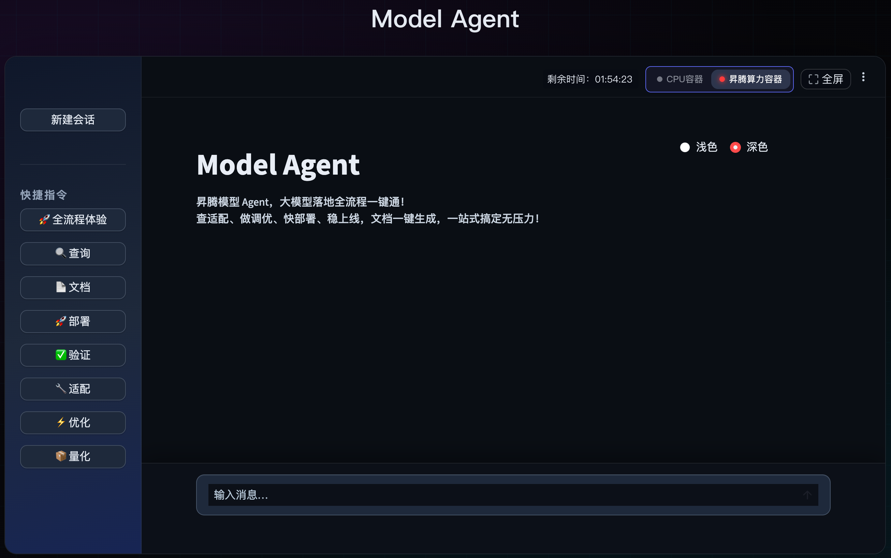

<div align="center">

# 昇腾 Model Agent

**昇腾模型全流程Agent** · 搜索 · 验证 · 适配 · 部署 · 量化 · 优化 · 文档 与 workflow全流程编排

**[🌐 全景平台](https://ai.gitcode.com/ascend-model-ecosystem)** · **[📇 Skills 导航](skills/skills.md)** · **[⚡ Ascend Skills Eval评测](./ascend-skills-eval/README.md)** · **[💬 GitCode 仓库](https://gitcode.com/Ascend/model-agent)**

<br/>



</div>

---

## 目录

- [项目概述](#项目概述)
- [最新动态](#最新动态)
- [快速开始](#快速开始)
- [仓库结构](#仓库结构)
- [Skills 技能库](#skills-技能库)
- [使用建议](#使用建议)
- [贡献方式](#贡献方式)

---

## 📢 项目概述

### 项目定位

**Model Agent** 是面向昇腾生态的模型开发与优化技能仓库，聚焦模型从适配、部署、验证到性能调优的全流程能力沉淀。  
仓库以 Skills 形式组织可复用能力模块，便于在不同 Agent / Team 场景中快速组合与落地。

### 目标用户

- 昇腾 NPU 平台模型开发与部署工程师
- 大模型推理性能优化工程师
- 模型迁移与适配开发者
- 需要构建自定义 Agent 能力的社区贡献者

---

## 🔥 最新动态

- **2026-04-30** — 新增 `[ascend-skills-eval/](./ascend-skills-eval/README.md)`：面向昇腾的Skill**s 评测系统**——九维打分、改进建议、Markdown 报告与成果卡。[在线体验（演示站）](https://ascend-skills-eval.zeabur.app/) ; Model Agent 重构，支持全流程workflow运行
- 2026-04-29 — 新增500+已验证模型，累计支持1000+
- **2026-04-25** — 平台数据完成刷新，500+模型指南上线使用
- **2026-04-20** — 高效工具版块上线，提供Trio云端训推服务
- **2026-04-16** — Model Agent SkillHub上线，100+skills一站式查询调用
- **2026-04-15** — CPU&算力容器双模式上线，模型查询功能快捷响应
- **2026-04-10** — 模型平台正式面向上线社区，提供一站式昇腾模型服务！
- **2026-03-30** — 模型平台正式开启内测！

---

## ⚡ 快速开始

### 平台在线体验（推荐）

直接访问[昇腾模型生态全景平台](https://ai.gitcode.com/ascend-model-ecosystem)，在线体验！

### Plugin 安装（推荐）

Claude Code

```bash
# 注册 marketplace（首次）
/plugin marketplace add holyorevil/ascend-model-agent-plugin
# 安装 model-agent插件
/plugin install ascend-model-agent-plugin@ascend-model-agent-plugin

# 激活插件（加载 Skills/Agents/Hooks）
/reload-plugins

# 触发初始化：以下任一方式均可
# 方式 a：新开会话（推荐，自然触发 SessionStart）
# 方式 b：在当前会话中执行 /clear（会清空当前对话历史）
```

AtomCode 

```bash
# 注册 marketplace（首次）
`/plugin marketplace add https://gitcode.com/gmq123/ascend-model-agent-plugin`

# 安装 model-agent插件
`/plugin install ascend-model-agent-plugin@ascend-model-agent-plugin`

# 安装完成后，建议用以下命令确认状态：
`/plugin list`
```

### 手动添加skills

```bash
git clone https://gitcode.com/Ascend/model-agent.git
# 将 model-agent 下的 skills 目录拷贝到 Agent 工具的 skills 目录（以 Claude Code 为例）
# 请勿把 ascend-skills-eval/ 整块挪进 ~/.claude/skills（它是独立评测工程，不是 Skill 合集）
mv model-agent/skills/* ~/.claude/skills/
```

如需查看全部技能清单与分类，请阅读 **Skills 技能库** 部分。需要做 **Skill 文档质量自检** 时，见 `[ascend-skills-eval/](./ascend-skills-eval/README.md)`（与技能分类导航配合使用：一个管「选什么能力」，一个管「文档是否过关」）。

---

## 🔍 仓库结构

```text
model-agent/
├── apps/
│   ├── api-gateway/
│   └── console/
├── skills/
│   ├── skills.md                  # 7 大分类导航与统计
│   ├── examples/                  # 跨分类使用样例（新增）
│   ├── optimization/              # 性能优化（69）
│   ├── verification/              # 质量验证（51）
│   ├── deployment/                # 模型部署（15）
│   ├── adaptation/                # 模型适配（14）
│   ├── documentation/             # 文档生成（10）
│   ├── quantization/              # 模型量化（2）
│   └── search/                    # 知识检索（1）
├── ascend-skills-eval/           # SKILL 结构评测工具（FastAPI Web、粘贴/单仓/批量、报告与 PNG 成果卡）
├── core/
│   ├── intent-router/
│   ├── orchestrator/
│   ├── policy-engine/
│   └── telemetry/
├── workflows/
│   ├── training/
│   ├── inference/
│   ├── recommendation/
│   └── industry-templates/
├── adapters/
│   ├── ascend/
│   ├── llm-providers/
│   └── vector-db/
├── governance/
│   ├── auth/
│   ├── audit/
│   └── safety/
└── tests/
    ├── contract/
    ├── e2e/
    └── benchmark/
```

---

## 🚀 Skills 技能库

按场景把可复用 Skill 归好类，方便从任务反查该用哪份 `SKILL.md`。更细条目、原始链接与样例见 `skills/skills.md` 与下方各表。

当前仓库 Skills 已按场景完成分类整理（详见 `skills/skills.md`）：


| 场景     | 数量      | 说明                  |
| ------ | ------- | ------------------- |
| 性能优化   | 69      | 算子/推理性能分析、瓶颈定位、优化落地 |
| 质量验证   | 51      | 精度验证、代码评审、测试生成、问题排查 |
| 模型部署   | 15      | 部署流程、环境配置、运行验证      |
| 模型适配   | 14      | 框架迁移、版本兼容、适配改造      |
| 文档生成   | 10      | 文档规范、测试报告、知识沉淀      |
| 模型量化   | 2       | 量化相关流程与实践           |
| 知识检索   | 1       | 文档检索与知识查询           |
| **合计** | **162** | —                   |


**与评测系统打个配合**（可选）：写完或改版 `SKILL.md` 后，可用 `[ascend-skills-eval](./ascend-skills-eval/README.md)` 做一次评测体检（九维打分、改进建议、报告与成果卡 PNG），优化skills。


|                   | 说明                                                                   |
| ----------------- | -------------------------------------------------------------------- |
| 📇 **怎么找 Skill**  | 先扫 `skills/skills.md` 与下方分类表 → 点开对应条目里的「Skill原始链接」或本地目录阅读 `SKILL.md` |
| 📂 **怎么用进 Agent** | 通常只需拷贝目标 Skill 所属子目录到你的 Agent skills 路径；不一定要整桌 `skills/` 全集          |
| ⚡ **怎么把文档写好**     | 参考各 Skill 的写法，再配合 `ascend-skills-eval` 做 frontmatter、工作流步骤、边界与检查点自检  |


### 全量 Skills 清单

以下按 `skills/skills.md` 的 7 个分类呈现：

#### 性能优化


| Agent Skills名称                           | 类型           | 适用场景                                                                   | Skill原始链接                                                                                                                            | 来源                   | 使用样例                                          |
| ---------------------------------------- | ------------ | ---------------------------------------------------------------------- | ------------------------------------------------------------------------------------------------------------------------------------ | -------------------- | --------------------------------------------- |
| adapt-agent                              | Optimization | 适用于adapt-agent相关任务的分析、实施与问题处理场景。                                       | [链接](https://gitcode.com/MoFixGo/adapt-agent/-/blob/main/SKILL.md)                                                                   | 昇腾模型生态团队             | -                                             |
| ai4s-basic                               | Optimization | 适用于ai4s-basic相关任务的分析、实施与问题处理场景。                                        | [链接](https://gitcode.com/AI4Science/AscendSkills/-/blob/main/models/ai4s-basic/SKILL.md)                                             | 昇腾模型生态团队             | -                                             |
| ai4s-main                                | Optimization | 适用于ai4s-main相关任务的分析、实施与问题处理场景。                                         | [链接](https://gitcode.com/AI4Science/AscendSkills/-/blob/main/ai4s-main/SKILL.md)                                                     | 昇腾模型生态团队             | -                                             |
| ai4s-perf-tuning                         | Optimization | 适用于ai4s-perf-tuning相关任务的分析、实施与问题处理场景。                                  | [链接](https://gitcode.com/AI4Science/AscendSkills/-/blob/main/ai4s-perf-tuning/SKILL.md)                                              | 昇腾模型生态团队             | -                                             |
| ai4s-precision-alignment                 | Optimization | 适用于ai4s-precision-alignment相关任务的分析、实施与问题处理场景。                          | [链接](https://gitcode.com/AI4Science/AscendSkills/-/blob/main/ai4s-precision-alignment/SKILL.md)                                      | 昇腾模型生态团队             | -                                             |
| ai4s-profiling                           | Optimization | 适用于ai4s-profiling相关任务的分析、实施与问题处理场景。                                    | [链接](https://gitcode.com/AI4Science/AscendSkills/-/blob/main/ai4s-profiling/SKILL.md)                                                | 昇腾模型生态团队             | -                                             |
| analyse-coverage                         | Optimization | 适用于analyse-coverage相关任务的分析、实施与问题处理场景。                                  | [链接](https://gitcode.com/Ascend/agent-skills/-/blob/main/skills/mindspeed-llm-auto-ut-skills/skills/analyse-coverage/SKILL.md)       | Ascend/agent-skills仓 | -                                             |
| ascend-affinity-operator                 | Optimization | 适用于ascend-affinity-operator相关任务的分析、实施与问题处理场景。                          | [链接](https://gitcode.com/MoFixGo/optimization-agent/-/blob/main/ascend-affinity-operator/SKILL.md)                                   | 昇腾模型生态团队             | -                                             |
| ascend-history-to-skill                  | Optimization | 适用于ascend-history-to-skill相关任务的分析、实施与问题处理场景。                           | [链接](https://gitcode.com/MoFixGo/deploy-agent/-/blob/main/ascend-history-to-skill/SKILL.md)                                          | 昇腾模型生态团队             | -                                             |
| ascend-optimization                      | Optimization | 适用于ascend-optimization相关任务的分析、实施与问题处理场景。                               | [链接](https://gitcode.com/MoFixGo/optimization-agent/-/blob/main/ascend-optimization/SKILL.md)                                        | 昇腾模型生态团队             | [样例](./skills/examples/Qwen3-32B-w8a8优化案例.md) |
| ascend-profiling                         | Optimization | 适用于ascend-profiling相关任务的分析、实施与问题处理场景。                                  | [链接](https://gitcode.com/MoFixGo/optimization-agent/-/blob/main/ascend-profiling/SKILL.md)                                           | 昇腾模型生态团队             | -                                             |
| ascendc-api-best-practices               | Optimization | 适用于ascendc-api-best-practices相关任务的分析、实施与问题处理场景。                        | [链接](https://gitcode.com/cann/skills/-/blob/main/ops/skills/ascendc-api-best-practices/SKILL.md)                                     | 海思CANN团队             | -                                             |
| ascendc-code-review                      | Optimization | 适用于ascendc-code-review相关任务的分析、实施与问题处理场景。                               | [链接](https://gitcode.com/cann/skills/-/blob/main/ops/skills/ascendc-code-review/SKILL.md)                                            | 海思CANN团队             | -                                             |
| ascendc-direct-invoke-template           | Optimization | 适用于ascendc-direct-invoke-template相关任务的分析、实施与问题处理场景。                    | [链接](https://gitcode.com/cann/skills/-/blob/main/ops/skills/ascendc-direct-invoke-template/SKILL.md)                                 | 海思CANN团队             | -                                             |
| ascendc-operator-code-gen                | Optimization | 适用于ascendc-operator-code-gen相关任务的分析、实施与问题处理场景。                         | [链接](https://gitcode.com/Ascend/agent-skills/-/blob/main/skills/ascendc-operator-code-gen/SKILL.md)                                  | Ascend/agent-skills仓 | -                                             |
| ascendc-operator-design                  | Optimization | 适用于ascendc-operator-design相关任务的分析、实施与问题处理场景。                           | [链接](https://gitcode.com/Ascend/agent-skills/-/blob/main/skills/ascendc-operator-design/SKILL.md)                                    | Ascend/agent-skills仓 | -                                             |
| ascendc-operator-performance-eval        | Optimization | 适用于ascendc-operator-performance-eval相关任务的分析、实施与问题处理场景。                 | [链接](https://gitcode.com/Ascend/agent-skills/-/blob/main/skills/ascendc-operator-performance-eval/SKILL.md)                          | Ascend/agent-skills仓 | -                                             |
| ascendc-operator-performance-optim       | Optimization | 适用于ascendc-operator-performance-optim相关任务的分析、实施与问题处理场景。                | [链接](https://gitcode.com/Ascend/agent-skills/-/blob/main/skills/ascendc-operator-performance-optim/SKILL.md)                         | Ascend/agent-skills仓 | -                                             |
| ascendc-registry-invoke-to-direct-invoke | Optimization | 适用于ascendc-registry-invoke-to-direct-invoke相关任务的分析、实施与问题处理场景。          | [链接](https://gitcode.com/cann/skills/-/blob/main/ops/skills/ascendc-registry-invoke-to-direct-invoke/SKILL.md)                       | 海思CANN团队             | -                                             |
| ascendc-runtime-debug                    | Unknown      | 适用于ascendc-runtime-debug相关任务的分析、实施与问题处理场景。                             | [链接](https://gitcode.com/cann/skills/-/blob/main/ops/skills/ascendc-runtime-debug/SKILL.md)                                          | 海思CANN团队             | -                                             |
| ascendc-task-focus                       | Unknown      | 适用于ascendc-task-focus相关任务的分析、实施与问题处理场景。                                | [链接](https://gitcode.com/cann/skills/-/blob/main/ops/skills/ascendc-task-focus/SKILL.md)                                             | 海思CANN团队             | -                                             |
| ascendc-tiling-design                    | Optimization | 适用于ascendc-tiling-design相关任务的分析、实施与问题处理场景。                             | [链接](https://gitcode.com/cann/skills/-/blob/main/ops/skills/ascendc-tiling-design/SKILL.md)                                          | 海思CANN团队             | -                                             |
| catlass-operator-dev                     | Optimization | 适用于catlass-operator-dev相关任务的分析、实施与问题处理场景。                              | [链接](https://gitcode.com/Ascend/agent-skills/-/blob/main/skills/catlass-operator-dev/SKILL.md)                                       | Ascend/agent-skills仓 | -                                             |
| catlass-operator-performance-optim       | Optimization | 适用于catlass-operator-performance-optim相关任务的分析、实施与问题处理场景。                | [链接](https://gitcode.com/Ascend/agent-skills/-/blob/main/skills/catlass-operator-performance-optim/SKILL.md)                         | Ascend/agent-skills仓 | -                                             |
| code-comprehension                       | Optimization | 适用于code-comprehension相关任务的分析、实施与问题处理场景。                                | [链接](https://gitcode.com/Ascend/agent-skills/-/blob/main/skills/mindspeed-llm-auto-ut-skills/skills/code-comprehension/SKILL.md)     | Ascend/agent-skills仓 | -                                             |
| debug                                    | Optimization | 适用于debug相关任务的分析、实施与问题处理场景。                                             | [链接](https://gitcode.com/Ascend/agent-skills/-/blob/main/skills/drivingsdk-ascend-model-migration/ssh-connection/debug/SKILL.md)     | Ascend/agent-skills仓 | -                                             |
| deepfri-tf-npu                           | Optimization | 适用于deepfri-tf-npu相关任务的分析、实施与问题处理场景。                                    | [链接](https://gitcode.com/AI4Science/AscendSkills/-/blob/main/models/deepfri-tf-npu/SKILL.md)                                         | 昇腾模型生态团队             | -                                             |
| diffsbdd                                 | Optimization | 适用于diffsbdd相关任务的分析、实施与问题处理场景。                                          | [链接](https://gitcode.com/AI4Science/AscendSkills/-/blob/main/models/diffsbdd/SKILL.md)                                               | 昇腾模型生态团队             | -                                             |
| generative-recommendation-verification   | Optimization | 适用于generative-recommendation-verification相关任务的分析、实施与问题处理场景。            | [链接](https://gitcode.com/raintBN/Ascend-Skills/-/blob/main/generative-recommendation-verification/SKILL.md)                          | 昇腾模型生态团队             | -                                             |
| issue_solver                             | Optimization | 适用于issue_solver相关任务的分析、实施与问题处理场景。                                      | [链接](https://gitcode.com/raintBN/Ascend-Skills/-/blob/main/issue_solver/SKILL.md)                                                    | 昇腾模型生态团队             | -                                             |
| long-task                                | Optimization | 适用于long-task相关任务的分析、实施与问题处理场景。                                         | [链接](https://gitcode.com/Ascend/agent-skills/-/blob/main/skills/drivingsdk-ascend-model-migration/ssh-connection/long-task/SKILL.md) | Ascend/agent-skills仓 | -                                             |
| model-infer-fusion                       | Optimization | 适用于model-infer-fusion相关任务的分析、实施与问题处理场景。                                | [链接](https://gitcode.com/cann/skills/-/blob/main/model/skills/model-infer-fusion/SKILL.md)                                           | 海思CANN团队             | -                                             |
| model-infer-graph-mode                   | Optimization | 适用于model-infer-graph-mode相关任务的分析、实施与问题处理场景。                            | [链接](https://gitcode.com/cann/skills/-/blob/main/model/skills/model-infer-graph-mode/SKILL.md)                                       | 海思CANN团队             | -                                             |
| model-infer-kvcache                      | Optimization | 适用于model-infer-kvcache相关任务的分析、实施与问题处理场景。                               | [链接](https://gitcode.com/cann/skills/-/blob/main/model/skills/model-infer-kvcache/SKILL.md)                                          | 海思CANN团队             | -                                             |
| model-infer-migrator                     | Optimization | 适用于model-infer-migrator相关任务的分析、实施与问题处理场景。                              | [链接](https://gitcode.com/cann/skills/-/blob/main/model/skills/model-infer-migrator/SKILL.md)                                         | 海思CANN团队             | -                                             |
| model-infer-multi-stream                 | Optimization | 适用于model-infer-multi-stream相关任务的分析、实施与问题处理场景。                          | [链接](https://gitcode.com/cann/skills/-/blob/main/model/skills/model-infer-multi-stream/SKILL.md)                                     | 海思CANN团队             | -                                             |
| model-infer-optimize                     | Optimization | 适用于model-infer-optimize相关任务的分析、实施与问题处理场景。                              | [链接](https://gitcode.com/cann/skills/-/blob/main/model/teams/infer-model-optimize-team/model-infer-optimize/SKILL.md)                | 海思CANN团队             | [样例](./skills/examples/torch-npu推理优化.md)      |
| model-infer-parallel-analysis            | Optimization | 适用于model-infer-parallel-analysis相关任务的分析、实施与问题处理场景。                     | [链接](https://gitcode.com/cann/skills/-/blob/main/model/skills/model-infer-parallel-analysis/SKILL.md)                                | 海思CANN团队             | -                                             |
| model-infer-precision-debug              | Optimization | 适用于model-infer-precision-debug相关任务的分析、实施与问题处理场景。                       | [链接](https://gitcode.com/cann/skills/-/blob/main/model/skills/model-infer-precision-debug/SKILL.md)                                  | 海思CANN团队             | -                                             |
| model-infer-prefetch                     | Optimization | 适用于model-infer-prefetch相关任务的分析、实施与问题处理场景。                              | [链接](https://gitcode.com/cann/skills/-/blob/main/model/skills/model-infer-prefetch/SKILL.md)                                         | 海思CANN团队             | -                                             |
| model-infer-runtime-debug                | Optimization | 适用于model-infer-runtime-debug相关任务的分析、实施与问题处理场景。                         | [链接](https://gitcode.com/cann/skills/-/blob/main/model/skills/model-infer-runtime-debug/SKILL.md)                                    | 海思CANN团队             | -                                             |
| model-infer-superkernel                  | Optimization | 适用于model-infer-superkernel相关任务的分析、实施与问题处理场景。                           | [链接](https://gitcode.com/cann/skills/-/blob/main/model/skills/model-infer-superkernel/SKILL.md)                                      | 海思CANN团队             | -                                             |
| npu-adapter-reviewer                     | Optimization | 适用于npu-adapter-reviewer相关任务的分析、实施与问题处理场景。                              | [链接](https://gitcode.com/Ascend/agent-skills/-/blob/main/skills/npu-adapter-reviewer/SKILL.md)                                       | Ascend/agent-skills仓 | -                                             |
| ops-profiling                            | Optimization | 适用于ops-profiling相关任务的分析、实施与问题处理场景。                                     | [链接](https://gitcode.com/cann/skills/-/blob/main/ops/skills/ops-profiling/SKILL.md)                                                  | 海思CANN团队             | -                                             |
| perf-analyzer                            | Optimization | 适用于perf-analyzer相关任务的分析、实施与问题处理场景。                                     | [链接](https://gitcode.com/cann/skills/-/blob/main/ops/skills/pypto-op-perf-tune/perf-analyzer/SKILL.md)                               | 海思CANN团队             | -                                             |
| pypto-intent-understand                  | Optimization | 适用于pypto-intent-understand相关任务的分析、实施与问题处理场景。                           | [链接](https://gitcode.com/cann/skills/-/blob/main/ops/skills/pypto-intent-understand/SKILL.md)                                        | 海思CANN团队             | -                                             |
| pypto-op-perf-tune                       | Optimization | 适用于pypto-op-perf-tune相关任务的分析、实施与问题处理场景。                                | [链接](https://gitcode.com/cann/skills/-/blob/main/ops/skills/pypto-op-perf-tune/SKILL.md)                                             | 海思CANN团队             | -                                             |
| pypto-precision-debug                    | Optimization | 适用于pypto-precision-debug相关任务的分析、实施与问题处理场景。                             | [链接](https://gitcode.com/cann/skills/-/blob/main/ops/skills/pypto-precision-debug/SKILL.md)                                          | 海思CANN团队             | -                                             |
| pytest-writer                            | Optimization | 适用于pytest-writer相关任务的分析、实施与问题处理场景。                                     | [链接](https://gitcode.com/Ascend/agent-skills/-/blob/main/skills/mindspeed-llm-auto-ut-skills/skills/pytest-writer/SKILL.md)          | Ascend/agent-skills仓 | -                                             |
| python-refactoring                       | Optimization | 适用于python-refactoring相关任务的分析、实施与问题处理场景。                                | [链接](https://gitcode.com/Ascend/agent-skills/-/blob/main/skills/python-refactoring/SKILL.md)                                         | Ascend/agent-skills仓 | -                                             |
| simple-vector-triton-gpu-to-npu          | Optimization | 适用于simple-vector-triton-gpu-to-npu相关任务的分析、实施与问题处理场景。                   | [链接](https://gitcode.com/Ascend/agent-skills/-/blob/main/skills/simple-vector-triton-gpu-to-npu/SKILL.md)                            | Ascend/agent-skills仓 | -                                             |
| tilelang-api-best-practices              | Optimization | 适用于tilelang-api-best-practices相关任务的分析、实施与问题处理场景。                       | [链接](https://gitcode.com/cann/skills/-/blob/main/ops-lab/tilelang/skills/tilelang-api-best-practices/SKILL.md)                       | 海思CANN团队             | -                                             |
| tilelang-op-developer                    | Optimization | 适用于tilelang-op-developer相关任务的分析、实施与问题处理场景。                             | [链接](https://gitcode.com/cann/skills/-/blob/main/ops-lab/tilelang/skills/tilelang-op-developer/SKILL.md)                             | 海思CANN团队             | -                                             |
| tilelang-programming-model-guide         | Optimization | 适用于tilelang-programming-model-guide相关任务的分析、实施与问题处理场景。                  | [链接](https://gitcode.com/cann/skills/-/blob/main/ops-lab/tilelang/skills/tilelang-programming-model-guide/SKILL.md)                  | 海思CANN团队             | -                                             |
| tilelang-vector-ascend-ops-migration     | Optimization | 本skill用于指导TileLang算子从GPU（CUDA）平台迁移到华为昇腾NPU平台。通过分析GPU实现，自动生成对应的NPU实现代码。 | [链接](https://gitcode.com/Ascend/agent-skills/-/blob/main/skills/tilelang-vector-ascend-ops-migration/SKILL.md)                       | Ascend/agent-skills仓 | -                                             |
| triton-operator-code-review              | Unknown      | 适用于triton-operator-code-review相关任务的分析、实施与问题处理场景。                       | [链接](https://gitcode.com/Ascend/agent-skills/-/blob/main/skills/triton-operator-code-review/SKILL.md)                                | Ascend/agent-skills仓 | -                                             |
| triton-operator-design                   | Optimization | 适用于triton-operator-design相关任务的分析、实施与问题处理场景。                            | [链接](https://gitcode.com/Ascend/agent-skills/-/blob/main/skills/triton-operator-design/SKILL.md)                                     | Ascend/agent-skills仓 | -                                             |
| triton-operator-dev                      | Optimization | 适用于triton-operator-dev相关任务的分析、实施与问题处理场景。                               | [链接](https://gitcode.com/Ascend/agent-skills/-/blob/main/skills/triton-operator-dev/SKILL.md)                                        | Ascend/agent-skills仓 | -                                             |
| triton-operator-performance-eval         | Optimization | 适用于triton-operator-performance-eval相关任务的分析、实施与问题处理场景。                  | [链接](https://gitcode.com/Ascend/agent-skills/-/blob/main/skills/triton-operator-performance-eval/SKILL.md)                           | Ascend/agent-skills仓 | -                                             |
| triton-operator-performance-optim        | Optimization | 适用于triton-operator-performance-optim相关任务的分析、实施与问题处理场景。                 | [链接](https://gitcode.com/Ascend/agent-skills/-/blob/main/skills/triton-operator-performance-optim/SKILL.md)                          | Ascend/agent-skills仓 | -                                             |
| triton-operator-precision-eval           | Optimization | 适用于triton-operator-precision-eval相关任务的分析、实施与问题处理场景。                    | [链接](https://gitcode.com/Ascend/agent-skills/-/blob/main/skills/triton-operator-precision-eval/SKILL.md)                             | Ascend/agent-skills仓 | -                                             |
| tune-frontend                            | Optimization | 适用于tune-frontend相关任务的分析、实施与问题处理场景。                                     | [链接](https://gitcode.com/cann/skills/-/blob/main/ops/skills/pypto-op-perf-tune/tune-frontend/SKILL.md)                               | 海思CANN团队             | -                                             |
| tune-incore                              | Optimization | 适用于tune-incore相关任务的分析、实施与问题处理场景。                                       | [链接](https://gitcode.com/cann/skills/-/blob/main/ops/skills/pypto-op-perf-tune/tune-incore/SKILL.md)                                 | 海思CANN团队             | -                                             |
| tune-swimlane                            | Optimization | 适用于tune-swimlane相关任务的分析、实施与问题处理场景。                                     | [链接](https://gitcode.com/cann/skills/-/blob/main/ops/skills/pypto-op-perf-tune/tune-swimlane/SKILL.md)                               | 海思CANN团队             | -                                             |
| tunnel                                   | Optimization | 适用于tunnel相关任务的分析、实施与问题处理场景。                                            | [链接](https://gitcode.com/Ascend/agent-skills/-/blob/main/skills/drivingsdk-ascend-model-migration/ssh-connection/tunnel/SKILL.md)    | Ascend/agent-skills仓 | -                                             |
| unittest-writer                          | Optimization | 适用于unittest-writer相关任务的分析、实施与问题处理场景。                                   | [链接](https://gitcode.com/Ascend/agent-skills/-/blob/main/skills/mindspeed-llm-auto-ut-skills/skills/unittest-writer/SKILL.md)        | Ascend/agent-skills仓 | -                                             |
| vector-triton-ascend-ops-optimizer       | Optimization | 适用于vector-triton-ascend-ops-optimizer相关任务的分析、实施与问题处理场景。                | [链接](https://gitcode.com/Ascend/agent-skills/-/blob/main/skills/vector-triton-ascend-ops-optimizer/SKILL.md)                         | Ascend/agent-skills仓 | -                                             |
| verl-async-dapo                          | Optimization | 适用于verl-async-dapo相关任务的分析、实施与问题处理场景。                                   | [链接](https://gitcode.com/Ascend/agent-skills/-/blob/main/skills/verl-async-dapo/SKILL.md)                                            | Ascend/agent-skills仓 | -                                             |
| vLLM-ascend_FAQ_Generator                | Optimization | 适用于vLLM-ascend_FAQ_Generator相关任务的分析、实施与问题处理场景。                         | [链接](https://gitcode.com/Ascend/agent-skills/-/blob/main/skills/vLLM-ascend_FAQ_Generator/SKILL.md)                                  | Ascend/agent-skills仓 | -                                             |


#### 质量验证


| Agent Skills名称                   | 类型           | 适用场景                                                        | Skill原始链接                                                                                                                                         | 来源                   | 使用样例                                   |
| -------------------------------- | ------------ | ----------------------------------------------------------- | ------------------------------------------------------------------------------------------------------------------------------------------------- | -------------------- | -------------------------------------- |
| ascend-mmlab-install-suite       | Verification | 适用于ascend-mmlab-install-suite相关任务的分析、实施与问题处理场景。             | [链接](https://gitcode.com/Ascend/agent-skills/-/blob/main/skills/drivingsdk-ascend-model-migration/ascend-mmlab-install-suite/SKILL.md)            | Ascend/agent-skills仓 | -                                      |
| ascend-profiling-anomaly         | Verification | 适用于ascend-profiling-anomaly相关任务的分析、实施与问题处理场景。               | [链接](https://gitcode.com/Ascend/agent-skills/-/blob/main/skills/ascend-profiling-anomaly/SKILL.md)                                                | Ascend/agent-skills仓 | -                                      |
| ascend-tf-community              | Verification | 适用于ascend-tf-community相关任务的分析、实施与问题处理场景。                    | [链接](https://gitcode.com/AI4Science/AscendSkills/-/blob/main/tf-framework/ascend-tf-community/SKILL.md)                                           | 昇腾模型生态团队             | -                                      |
| ascendc-env-check                | Verification | 适用于ascendc-env-check相关任务的分析、实施与问题处理场景。                      | [链接](https://gitcode.com/cann/skills/-/blob/main/ops/skills/ascendc-env-check/SKILL.md)                                                           | 海思CANN团队             | -                                      |
| ascendc-operator-code-review     | Verification | 适用于ascendc-operator-code-review相关任务的分析、实施与问题处理场景。           | [链接](https://gitcode.com/Ascend/agent-skills/-/blob/main/skills/ascendc-operator-code-review/SKILL.md)                                            | Ascend/agent-skills仓 | -                                      |
| ascendc-operator-compile-debug   | Verification | 适用于ascendc-operator-compile-debug相关任务的分析、实施与问题处理场景。         | [链接](https://gitcode.com/Ascend/agent-skills/-/blob/main/skills/ascendc-operator-compile-debug/SKILL.md)                                          | Ascend/agent-skills仓 | -                                      |
| ascendc-operator-dev             | Verification | 适用于ascendc-operator-dev相关任务的分析、实施与问题处理场景。                   | [链接](https://gitcode.com/Ascend/agent-skills/-/blob/main/skills/ascendc-operator-dev/SKILL.md)                                                    | Ascend/agent-skills仓 | -                                      |
| ascendc-operator-doc-gen         | Verification | 适用于ascendc-operator-doc-gen相关任务的分析、实施与问题处理场景。               | [链接](https://gitcode.com/Ascend/agent-skills/-/blob/main/skills/ascendc-operator-doc-gen/SKILL.md)                                                | Ascend/agent-skills仓 | -                                      |
| ascendc-operator-mssanitizer     | Verification | 适用于ascendc-operator-mssanitizer相关任务的分析、实施与问题处理场景。           | [链接](https://gitcode.com/Ascend/agent-skills/-/blob/main/skills/ascendc-operator-mssanitizer/SKILL.md)                                            | Ascend/agent-skills仓 | -                                      |
| ascendc-operator-precision-debug | Verification | 适用于ascendc-operator-precision-debug相关任务的分析、实施与问题处理场景。       | [链接](https://gitcode.com/Ascend/agent-skills/-/blob/main/skills/ascendc-operator-precision-debug/SKILL.md)                                        | Ascend/agent-skills仓 | -                                      |
| ascendc-operator-precision-eval  | Verification | 适用于ascendc-operator-precision-eval相关任务的分析、实施与问题处理场景。        | [链接](https://gitcode.com/Ascend/agent-skills/-/blob/main/skills/ascendc-operator-precision-eval/SKILL.md)                                         | Ascend/agent-skills仓 | -                                      |
| ascendc-operator-project-init    | Verification | 适用于ascendc-operator-project-init相关任务的分析、实施与问题处理场景。          | [链接](https://gitcode.com/Ascend/agent-skills/-/blob/main/skills/ascendc-operator-project-init/SKILL.md)                                           | Ascend/agent-skills仓 | -                                      |
| ascendc-operator-testcase-gen    | Verification | 适用于ascendc-operator-testcase-gen相关任务的分析、实施与问题处理场景。          | [链接](https://gitcode.com/Ascend/agent-skills/-/blob/main/skills/ascendc-operator-testcase-gen/SKILL.md)                                           | Ascend/agent-skills仓 | -                                      |
| ascendc-precision-debug          | Verification | 适用于ascendc-precision-debug相关任务的分析、实施与问题处理场景。                | [链接](https://gitcode.com/cann/skills/-/blob/main/ops/skills/ascendc-precision-debug/SKILL.md)                                                     | 海思CANN团队             | -                                      |
| ascendc-st-design                | Verification | 适用于ascendc-st-design相关任务的分析、实施与问题处理场景。                      | [链接](https://gitcode.com/cann/skills/-/blob/main/ops/skills/ascendc-st-design/SKILL.md)                                                           | 海思CANN团队             | -                                      |
| ascendc-whitebox-design          | Verification | 适用于ascendc-whitebox-design相关任务的分析、实施与问题处理场景。                | [链接](https://gitcode.com/cann/skills/-/blob/main/ops/skills/ascendc-whitebox-design/SKILL.md)                                                     | 海思CANN团队             | -                                      |
| auto-bug-fixer                   | Verification | 适用于auto-bug-fixer相关任务的分析、实施与问题处理场景。                         | [链接](https://gitcode.com/Ascend/agent-skills/-/blob/main/skills/auto-bug-fixer/SKILL.md)                                                          | Ascend/agent-skills仓 | -                                      |
| auto-develop-test-gen            | Verification | 适用于auto-develop-test-gen相关任务的分析、实施与问题处理场景。                  | [链接](https://gitcode.com/Ascend/agent-skills/-/blob/main/skills/auto-develop-test-gen/SKILL.md)                                                   | Ascend/agent-skills仓 | -                                      |
| boltzgen                         | Verification | 适用于boltzgen相关任务的分析、实施与问题处理场景。                               | [链接](https://gitcode.com/AI4Science/AscendSkills/-/blob/main/models/boltzgen/SKILL.md)                                                            | 昇腾模型生态团队             | -                                      |
| cann-operator-env-config         | Verification | 适用于cann-operator-env-config相关任务的分析、实施与问题处理场景。               | [链接](https://gitcode.com/Ascend/agent-skills/-/blob/main/skills/cann-operator-env-config/SKILL.md)                                                | Ascend/agent-skills仓 | -                                      |
| catlass-operator-code-gen        | Verification | 适用于catlass-operator-code-gen相关任务的分析、实施与问题处理场景。              | [链接](https://gitcode.com/Ascend/agent-skills/-/blob/main/skills/catlass-operator-code-gen/SKILL.md)                                               | Ascend/agent-skills仓 | -                                      |
| catlass-operator-design          | Verification | 适用于catlass-operator-design相关任务的分析、实施与问题处理场景。                | [链接](https://gitcode.com/Ascend/agent-skills/-/blob/main/skills/catlass-operator-design/SKILL.md)                                                 | Ascend/agent-skills仓 | -                                      |
| deepfri                          | Verification | 适用于deepfri相关任务的分析、实施与问题处理场景。                                | [链接](https://gitcode.com/AI4Science/AscendSkills/-/blob/main/models/deepfri/SKILL.md)                                                             | 昇腾模型生态团队             | -                                      |
| detectron2                       | Verification | 适用于detectron2相关任务的分析、实施与问题处理场景。                             | [链接](https://gitcode.com/Ascend/agent-skills/-/blob/main/skills/drivingsdk-ascend-model-migration/ascend-mmlab-install-suite/detectron2/SKILL.md) | Ascend/agent-skills仓 | -                                      |
| generate-unit-test               | Verification | 适用于generate-unit-test相关任务的分析、实施与问题处理场景。                     | [链接](https://gitcode.com/Ascend/agent-skills/-/blob/main/skills/mindspeed-llm-auto-ut-skills/skills/generate-unit-test/SKILL.md)                  | Ascend/agent-skills仓 | -                                      |
| goedel-prover                    | Verification | 适用于goedel-prover相关任务的分析、实施与问题处理场景。                          | [链接](https://gitcode.com/AI4Science/AscendSkills/-/blob/main/models/goedel-prover/SKILL.md)                                                       | 昇腾模型生态团队             | -                                      |
| hccl-test                        | Verification | 适用于hccl-test相关任务的分析、实施与问题处理场景。                              | [链接](https://gitcode.com/Ascend/agent-skills/-/blob/main/skills/hccl-test/SKILL.md)                                                               | Ascend/agent-skills仓 | -                                      |
| issue_autoreply                  | Verification | 适用于issue_autoreply相关任务的分析、实施与问题处理场景。                        | [链接](https://gitcode.com/raintBN/Ascend-Skills/-/blob/main/issue_autoreply/SKILL.md)                                                              | 昇腾模型生态团队             | -                                      |
| megatron-commit-tracker          | Verification | 适用于megatron-commit-tracker相关任务的分析、实施与问题处理场景。                | [链接](https://gitcode.com/Ascend/agent-skills/-/blob/main/skills/megatron-commit-tracker/SKILL.md)                                                 | Ascend/agent-skills仓 | -                                      |
| mindspeed-fsdp2-config-migration | Verification | 适用于mindspeed-fsdp2-config-migration相关任务的分析、实施与问题处理场景。       | [链接](https://gitcode.com/Ascend/agent-skills/-/blob/main/skills/mindspeed-mm-fsdp2-migration/mindspeed-fsdp2-config-migration/SKILL.md)           | Ascend/agent-skills仓 | -                                      |
| mindspeed-fsdp2-data-migration   | Verification | 适用于mindspeed-fsdp2-data-migration相关任务的分析、实施与问题处理场景。         | [链接](https://gitcode.com/Ascend/agent-skills/-/blob/main/skills/mindspeed-mm-fsdp2-migration/mindspeed-fsdp2-data-migration/SKILL.md)             | Ascend/agent-skills仓 | -                                      |
| mindspeed-fsdp2-model-migration  | Verification | 适用于mindspeed-fsdp2-model-migration相关任务的分析、实施与问题处理场景。        | [链接](https://gitcode.com/Ascend/agent-skills/-/blob/main/skills/mindspeed-mm-fsdp2-migration/mindspeed-fsdp2-model-migration/SKILL.md)            | Ascend/agent-skills仓 | -                                      |
| mindspeed-fsdp2-verification     | Verification | 适用于mindspeed-fsdp2-verification相关任务的分析、实施与问题处理场景。           | [链接](https://gitcode.com/Ascend/agent-skills/-/blob/main/skills/mindspeed-mm-fsdp2-migration/mindspeed-fsdp2-verification/SKILL.md)               | Ascend/agent-skills仓 | -                                      |
| mmcv                             | Verification | 适用于mmcv相关任务的分析、实施与问题处理场景。                                   | [链接](https://gitcode.com/Ascend/agent-skills/-/blob/main/skills/drivingsdk-ascend-model-migration/ascend-mmlab-install-suite/mmcv/SKILL.md)       | Ascend/agent-skills仓 | -                                      |
| mmdet                            | Verification | 适用于mmdet相关任务的分析、实施与问题处理场景。                                  | [链接](https://gitcode.com/Ascend/agent-skills/-/blob/main/skills/drivingsdk-ascend-model-migration/ascend-mmlab-install-suite/mmdet/SKILL.md)      | Ascend/agent-skills仓 | -                                      |
| mmdet3d                          | Verification | 适用于mmdet3d相关任务的分析、实施与问题处理场景。                                | [链接](https://gitcode.com/Ascend/agent-skills/-/blob/main/skills/drivingsdk-ascend-model-migration/ascend-mmlab-install-suite/mmdet3d/SKILL.md)    | Ascend/agent-skills仓 | -                                      |
| model-infer-parallel-impl        | Verification | 适用于model-infer-parallel-impl相关任务的分析、实施与问题处理场景。              | [链接](https://gitcode.com/cann/skills/-/blob/main/model/skills/model-infer-parallel-impl/SKILL.md)                                                 | 海思CANN团队             | -                                      |
| model-training                   | Verification | 适用于model-training相关任务的分析、实施与问题处理场景。                         | [链接](https://gitcode.com/Ascend/agent-skills/-/blob/main/skills/drivingsdk-ascend-model-migration/model-training/SKILL.md)                        | Ascend/agent-skills仓 | [样例](./skills/examples/esm2运行结果.md)    |
| oligoformer                      | Verification | 适用于oligoformer相关任务的分析、实施与问题处理场景。                            | [链接](https://gitcode.com/AI4Science/AscendSkills/-/blob/main/models/oligoformer/SKILL.md)                                                         | 昇腾模型生态团队             | -                                      |
| ops-precision-standard           | Verification | 适用于ops-precision-standard相关任务的分析、实施与问题处理场景。                 | [链接](https://gitcode.com/cann/skills/-/blob/main/ops/skills/ops-precision-standard/SKILL.md)                                                      | 海思CANN团队             | -                                      |
| ops-simulator                    | Verification | 适用于ops-simulator相关任务的分析、实施与问题处理场景。                          | [链接](https://gitcode.com/cann/skills/-/blob/main/ops/skills/ops-simulator/SKILL.md)                                                               | 海思CANN团队             | -                                      |
| pypto-api-explore                | Verification | 适用于pypto-api-explore相关任务的分析、实施与问题处理场景。                      | [链接](https://gitcode.com/cann/skills/-/blob/main/ops/skills/pypto-api-explore/SKILL.md)                                                           | 海思CANN团队             | -                                      |
| pypto-golden-generate            | Verification | 适用于pypto-golden-generate相关任务的分析、实施与问题处理场景。                  | [链接](https://gitcode.com/cann/skills/-/blob/main/ops/skills/pypto-golden-generate/SKILL.md)                                                       | 海思CANN团队             | -                                      |
| pypto-op-design                  | Verification | 适用于pypto-op-design相关任务的分析、实施与问题处理场景。                        | [链接](https://gitcode.com/cann/skills/-/blob/main/ops/skills/pypto-op-design/SKILL.md)                                                             | 海思CANN团队             | -                                      |
| pypto-op-develop                 | Verification | 适用于pypto-op-develop相关任务的分析、实施与问题处理场景。                       | [链接](https://gitcode.com/cann/skills/-/blob/main/ops/skills/pypto-op-develop/SKILL.md)                                                            | 海思CANN团队             | -                                      |
| pypto-precision-compare          | Verification | 适用于pypto-precision-compare相关任务的分析、实施与问题处理场景。                | [链接](https://gitcode.com/cann/skills/-/blob/main/ops/skills/pypto-precision-compare/SKILL.md)                                                     | 海思CANN团队             | -                                      |
| quantify-agent                   | Verification | 适用于昇腾模型压缩与量化优化场景，支持基于 msmodelslim 的量化方案设计、校准配置与推理精度/性能权衡分析。 | [链接](https://github.com/starmountain1997/gvim/blob/main/g-claude/skills/msmodelslim/SKILL.md)                                                     | 昇腾模型生态团队             | [样例](./skills/examples/量化agent使用指南.md) |
| tilelang-op-design               | Verification | 适用于tilelang-op-design相关任务的分析、实施与问题处理场景。                     | [链接](https://gitcode.com/cann/skills/-/blob/main/ops-lab/tilelang/skills/tilelang-op-design/SKILL.md)                                             | 海思CANN团队             | -                                      |
| tilelang-review                  | Verification | 适用于tilelang-review相关任务的分析、实施与问题处理场景。                        | [链接](https://gitcode.com/cann/skills/-/blob/main/ops-lab/tilelang/skills/tilelang-review/SKILL.md)                                                | 海思CANN团队             | -                                      |
| triton-operator-code-gen         | Verification | 适用于triton-operator-code-gen相关任务的分析、实施与问题处理场景。               | [链接](https://gitcode.com/Ascend/agent-skills/-/blob/main/skills/triton-operator-code-gen/SKILL.md)                                                | Ascend/agent-skills仓 | -                                      |
| triton-operator-env-config       | Verification | 适用于triton-operator-env-config相关任务的分析、实施与问题处理场景。             | [链接](https://gitcode.com/Ascend/agent-skills/-/blob/main/skills/triton-operator-env-config/SKILL.md)                                              | Ascend/agent-skills仓 | -                                      |


#### 模型部署


| Agent Skills名称                       | 类型         | 适用场景                                                      | Skill原始链接                                                                                                                         | 来源                   | 使用样例                                                                 |
| ------------------------------------ | ---------- | --------------------------------------------------------- | --------------------------------------------------------------------------------------------------------------------------------- | -------------------- | -------------------------------------------------------------------- |
| Archived                             | Deployment | 自动、持续地发现、验证、归档开源大模型在昇腾NPU上的适配情况，构建一个可运行的昇腾模型生态知识库。        | [链接](https://gitcode.com/MoFixGo/verify-agent/-/blob/main/Archived/SKILL.md)                                                      | 昇腾模型生态团队             | -                                                                    |
| ascend-inference-repos-copilot       | Deployment | 适用于ascend-inference-repos-copilot相关任务的分析、实施与问题处理场景。       | [链接](https://gitcode.com/Ascend/agent-skills/-/blob/main/skills/ascend-inference-repos-copilot/SKILL.md)                          | Ascend/agent-skills仓 | -                                                                    |
| ascend-npu-driver-install            | Deployment | 适用于ascend-npu-driver-install相关任务的分析、实施与问题处理场景。            | [链接](https://gitcode.com/Ascend/agent-skills/-/blob/main/skills/ascend-npu-driver-install/SKILL.md)                               | Ascend/agent-skills仓 | -                                                                    |
| Ascend_Model_Verifier                | Deployment | 自动、持续地发现、验证、归档开源大模型在华为昇腾NPU上的适配情况，构建一个可运行的昇腾模型生态知识库。      | [链接](https://gitcode.com/raintBN/Ascend-Skills/-/blob/main/Ascend_Model_Verifier/SKILL.md)                                        | 昇腾模型生态团队             | [样例](./skills/examples/Qwen3.5-0.8B验证案例.md)                          |
| atc-model-converter                  | Deployment | 适用于atc-model-converter相关任务的分析、实施与问题处理场景。                  | [链接](https://gitcode.com/Ascend/agent-skills/-/blob/main/skills/atc-model-converter/SKILL.md)                                     | Ascend/agent-skills仓 | -                                                                    |
| deploy                               | Deployment | 适用于deploy相关任务的分析、实施与问题处理场景。                               | [链接](https://gitcode.com/Ascend/agent-skills/-/blob/main/skills/drivingsdk-ascend-model-migration/ssh-connection/deploy/SKILL.md) | Ascend/agent-skills仓 | [样例](./skills/examples/deploy-agent使用说明.md)                          |
| drivingsdk-ascend-model-migration    | Deployment | 适用于drivingsdk-ascend-model-migration相关任务的分析、实施与问题处理场景。    | [链接](https://gitcode.com/Ascend/agent-skills/-/blob/main/skills/drivingsdk-ascend-model-migration/SKILL.md)                       | Ascend/agent-skills仓 | -                                                                    |
| esm2-npu                             | Deployment | 适用于esm2-npu相关任务的分析、实施与问题处理场景。                             | [链接](https://gitcode.com/MoFixGo/deploy-agent/-/blob/main/esm2-npu/SKILL.md)                                                      | 昇腾模型生态团队             | [样例](./skills/examples/esm2优化日志.md)                                  |
| npu-smi                              | Deployment | 适用于npu-smi相关任务的分析、实施与问题处理场景。                              | [链接](https://gitcode.com/Ascend/agent-skills/-/blob/main/skills/npu-smi/SKILL.md)                                                 | Ascend/agent-skills仓 | -                                                                    |
| proteinbert                          | Deployment | 适用于proteinbert相关任务的分析、实施与问题处理场景。                          | [链接](https://gitcode.com/AI4Science/AscendSkills/-/blob/main/models/proteinbert/SKILL.md)                                         | 昇腾模型生态团队             | -                                                                    |
| repo-reader                          | Deployment | 适用于repo-reader相关任务的分析、实施与问题处理场景。                          | [链接](https://gitcode.com/MoFixGo/search-agent/-/blob/main/skill/repo-reader/SKILL.md)                                             | 昇腾模型生态团队             | -                                                                    |
| skill-auditor                        | Deployment | 适用于skill-auditor相关任务的分析、实施与问题处理场景。                        | [链接](https://gitcode.com/Ascend/agent-skills/-/blob/main/skills/skill-auditor/SKILL.md)                                           | Ascend/agent-skills仓 | -                                                                    |
| ssh-connection                       | Deployment | 适用于ssh-connection相关任务的分析、实施与问题处理场景。                       | [链接](https://gitcode.com/Ascend/agent-skills/-/blob/main/skills/drivingsdk-ascend-model-migration/ssh-connection/SKILL.md)        | Ascend/agent-skills仓 | -                                                                    |
| tf-to-pytorch                        | Deployment | 适用于tf-to-pytorch相关任务的分析、实施与问题处理场景。                        | [链接](https://gitcode.com/AI4Science/AscendSkills/-/blob/main/tf-framework/tf-to-pytorch/SKILL.md)                                 | 昇腾模型生态团队             | -                                                                    |
| vllm-ascend-performance-optimization | Deployment | 适用于vllm-ascend-performance-optimization相关任务的分析、实施与问题处理场景。 | [链接](https://gitcode.com/MoFixGo/optimization-agent/-/blob/main/vllm-ascend-performance-optimization/SKILL.md)                    | 昇腾模型生态团队             | [样例](./skills/examples/vllm-ascend-performance-optimization-使用指南.md) |


#### 模型适配


| Agent Skills名称                 | 类型         | 适用场景                                                | Skill原始链接                                                                                                                             | 来源                   | 使用样例                                                     |
| ------------------------------ | ---------- | --------------------------------------------------- | ------------------------------------------------------------------------------------------------------------------------------------- | -------------------- | -------------------------------------------------------- |
| adapter-check-principle        | Adaptation | 适用于adapter-check-principle相关任务的分析、实施与问题处理场景。        | [链接](https://gitcode.com/MoFixGo/search-agent/-/blob/main/skill/adapter-check-principle/SKILL.md)                                     | 昇腾模型生态团队             | -                                                        |
| ascend-model-verification      | Adaptation | 适用于ascend-model-verification相关任务的分析、实施与问题处理场景。      | [链接](https://gitcode.com/MoFixGo/verify-agent/-/blob/main/ascend-model-verification/SKILL.md)                                         | 昇腾模型生态团队             | [样例](./skills/examples/ascend-model-verification使用指南.md) |
| boltz2                         | Adaptation | 适用于boltz2相关任务的分析、实施与问题处理场景。                         | [链接](https://gitcode.com/AI4Science/AscendSkills/-/blob/main/models/boltz2/SKILL.md)                                                  | 昇腾模型生态团队             | -                                                        |
| generator                      | Adaptation | 适用于generator相关任务的分析、实施与问题处理场景。                      | [链接](https://gitcode.com/AI4Science/AscendSkills/-/blob/main/models/generator/SKILL.md)                                               | 昇腾模型生态团队             | -                                                        |
| hardware-check-principle       | Adaptation | 适用于hardware-check-principle相关任务的分析、实施与问题处理场景。       | [链接](https://gitcode.com/MoFixGo/search-agent/-/blob/main/skill/hardware-check-principle/SKILL.md)                                    | 昇腾模型生态团队             | -                                                        |
| megatron-change-analyzer       | Adaptation | 适用于megatron-change-analyzer相关任务的分析、实施与问题处理场景。       | [链接](https://gitcode.com/Ascend/agent-skills/-/blob/main/skills/megatron-change-analyzer/SKILL.md)                                    | Ascend/agent-skills仓 | -                                                        |
| megatron-impact-mapper         | Adaptation | 适用于megatron-impact-mapper相关任务的分析、实施与问题处理场景。         | [链接](https://gitcode.com/Ascend/agent-skills/-/blob/main/skills/megatron-impact-mapper/SKILL.md)                                      | Ascend/agent-skills仓 | -                                                        |
| megatron-migration-generator   | Adaptation | 适用于megatron-migration-generator相关任务的分析、实施与问题处理场景。   | [链接](https://gitcode.com/Ascend/agent-skills/-/blob/main/skills/megatron-migration-generator/SKILL.md)                                | Ascend/agent-skills仓 | -                                                        |
| mindspeed-fsdp2-migration-main | Adaptation | 适用于mindspeed-fsdp2-migration-main相关任务的分析、实施与问题处理场景。 | [链接](https://gitcode.com/Ascend/agent-skills/-/blob/main/skills/mindspeed-mm-fsdp2-migration/mindspeed-fsdp2-migration-main/SKILL.md) | Ascend/agent-skills仓 | -                                                        |
| model-migration                | Adaptation | 适用于model-migration相关任务的分析、实施与问题处理场景。                | [链接](https://gitcode.com/Ascend/agent-skills/-/blob/main/skills/drivingsdk-ascend-model-migration/model-migration/SKILL.md)           | Ascend/agent-skills仓 | [样例](./skills/examples/GLM-4-chat-9B适配案例.md)             |
| model-series-vendor-detector   | Unknown    | 适用于model-series-vendor-detector相关任务的分析、实施与问题处理场景。   | [链接](https://gitcode.com/MoFixGo/search-agent/-/blob/main/skill/model-series-vendor-detector/SKILL.md)                                | 昇腾模型生态团队             | -                                                        |
| msverl-daily-regression-triage | Unknown    | 适用于msverl-daily-regression-triage相关任务的分析、实施与问题处理场景。 | [链接](https://gitcode.com/Ascend/agent-skills/-/blob/main/skills/msverl-daily-regression-triage/SKILL.md)                              | Ascend/agent-skills仓 | -                                                        |
| uv-torch-adaptation            | Adaptation | 适用于uv-torch-adaptation相关任务的分析、实施与问题处理场景。            | [链接](https://gitcode.com/AI4Science/SLAI-AscendBridge/-/blob/main/.cursor/skills/uv-torch-adaptation/SKILL.md)                        | 昇腾模型生态团队             | -                                                        |
| vllm-ascend-model-adapter      | Adaptation | 适用于vllm-ascend-model-adapter相关任务的分析、实施与问题处理场景。      | [链接](https://github.com/vllm-project/vllm-ascend/blob/main/.agents/skills/vllm-ascend-model-adapter/SKILL.md)                                          | 小巧灵团队（来源于vLLM-ascend仓）             | [样例](./skills/examples/vllm-ascend-model-adapter使用指南.md) |


#### 文档生成


| Agent Skills名称                | 类型            | 适用场景                                               | Skill原始链接                                                                                                                            | 来源                   | 使用样例 |
| ----------------------------- | ------------- | -------------------------------------------------- | ------------------------------------------------------------------------------------------------------------------------------------ | -------------------- | ---- |
| ascend-docker                 | Documentation | 适用于ascend-docker相关任务的分析、实施与问题处理场景。                 | [链接](https://gitcode.com/Ascend/agent-skills/-/blob/main/skills/ascend-docker/SKILL.md)                                              | Ascend/agent-skills仓 | -    |
| ascendc-docs-gen              | Documentation | 适用于ascendc-docs-gen相关任务的分析、实施与问题处理场景。              | [链接](https://gitcode.com/cann/skills/-/blob/main/ops/skills/ascendc-docs-gen/SKILL.md)                                               | 海思CANN团队             | -    |
| ascendc-regbase-best-practice | Documentation | 适用于ascendc-regbase-best-practice相关任务的分析、实施与问题处理场景。 | [链接](https://gitcode.com/cann/skills/-/blob/main/ops/skills/ascendc-regbase-best-practice/SKILL.md)                                  | 海思CANN团队             | -    |
| ascendc-ut-develop            | Documentation | 适用于ascendc-ut-develop相关任务的分析、实施与问题处理场景。            | [链接](https://gitcode.com/cann/skills/-/blob/main/ops/skills/ascendc-ut-develop/SKILL.md)                                             | 海思CANN团队             | -    |
| connect                       | Documentation | 适用于connect相关任务的分析、实施与问题处理场景。                       | [链接](https://gitcode.com/Ascend/agent-skills/-/blob/main/skills/drivingsdk-ascend-model-migration/ssh-connection/connect/SKILL.md)   | Ascend/agent-skills仓 | -    |
| coverage                      | Documentation | 适用于coverage相关任务的分析、实施与问题处理场景。                      | [链接](https://gitcode.com/Ascend/agent-skills/-/blob/main/skills/mindspeed-llm-auto-ut-skills/skills/coverage/SKILL.md)               | Ascend/agent-skills仓 | -    |
| run-mindspeed-llm-test        | Documentation | 适用于run-mindspeed-llm-test相关任务的分析、实施与问题处理场景。        | [链接](https://gitcode.com/Ascend/agent-skills/-/blob/main/skills/mindspeed-llm-auto-ut-skills/skills/run-mindspeed-llm-test/SKILL.md) | Ascend/agent-skills仓 | -    |
| skill                         | Documentation | 适用于skill相关任务的分析、实施与问题处理场景。                         | [链接](https://gitcode.com/cann/skills/-/blob/main/ops-lab/ops-easyasc-dsl/skill/SKILL.md)                                             | 海思CANN团队             | -    |
| swanlab-setup                 | Documentation | 适用于swanlab-setup相关任务的分析、实施与问题处理场景。                 | [链接](https://gitcode.com/Ascend/agent-skills/-/blob/main/skills/swanlab-setup/SKILL.md)                                              | Ascend/agent-skills仓 | -    |
| triton-operator-doc-gen       | Documentation | 适用于triton-operator-doc-gen相关任务的分析、实施与问题处理场景。       | [链接](https://gitcode.com/Ascend/agent-skills/-/blob/main/skills/triton-operator-doc-gen/SKILL.md)                                    | Ascend/agent-skills仓 | -    |


#### 模型量化


| Agent Skills名称    | 类型           | 适用场景                                   | Skill原始链接                                                                              | 来源       | 使用样例                                            |
| ----------------- | ------------ | -------------------------------------- | -------------------------------------------------------------------------------------- | -------- | ----------------------------------------------- |
| ascendc-npu-arch  | Quantization | 适用于ascendc-npu-arch相关任务的分析、实施与问题处理场景。  | [链接](https://gitcode.com/cann/skills/-/blob/main/ops/skills/ascendc-npu-arch/SKILL.md) | 海思CANN团队 | -                                               |
| awesome-llm-model | Quantization | 适用于awesome-llm-model相关任务的分析、实施与问题处理场景。 | [链接](https://gitcode.com/raintBN/Ascend-Skills/-/blob/main/awesome-llm-model/SKILL.md) | 昇腾模型生态团队 | [样例](./skills/examples/sensitivity-analysis.md) |


#### 知识检索


| Agent Skills名称      | 类型     | 适用场景                                     | Skill原始链接                                                                                 | 来源       | 使用样例 |
| ------------------- | ------ | ---------------------------------------- | ----------------------------------------------------------------------------------------- | -------- | ---- |
| ascendc-docs-search | Search | 适用于ascendc-docs-search相关任务的分析、实施与问题处理场景。 | [链接](https://gitcode.com/cann/skills/-/blob/main/ops/skills/ascendc-docs-search/SKILL.md) | 海思CANN团队 | -    |


### 重点技能方向示例

- **模型推理优化**：`model-infer-optimize`、`model-infer-kvcache`、`model-infer-multi-stream`
- **模型适配迁移**：`model-migration`、`uv-torch-adaptation`、`vllm-ascend-model-adapter`
- **算子/内核调优**：`triton-operator-performance-optim`、`tilelang-op-developer`、`pypto-op-perf-tune`
- **质量保障**：`ascendc-operator-precision-eval`、`pytest-writer`、`skill-auditor`

---

## 🛠 使用建议

- 首先根据任务场景在 `skills/skills.md` 中定位对应分类
- 再进入目标 Skill 目录阅读 `SKILL.md` 的输入、输出与约束
- 多阶段任务建议串联多个 Skill（例如：适配 → 验证 → 优化 → 文档）

---

## 🤝 贡献方式

欢迎提交新 Skill 或改进现有 Skill。建议在提交前：

- 保持目录结构与命名风格一致
- 在 `SKILL.md` 中明确边界、步骤与输出格式
- 同步更新 `skills/skills.md` 的分类导航

对于使用过程中的经验、问题反馈欢迎提交 [Issue](https://gitcode.com/Ascend/model-agent/issues),也欢迎加入微信群交流

[联系我们](https://gitcode.com/Ascend/model-agent/discussions/2)