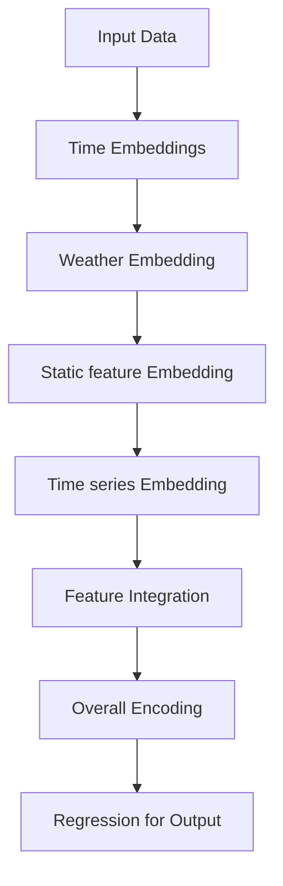

# 天权-Energy-R2 多源融合负荷预测算法 [](https://www.python.org/)

天权-Energy主网负荷预测算法融合气象预测与节假日嵌入，有效提升负荷预测整体精度。

## 📋 Table of Contents

- [💻 Basic Usage](#-basic-usage)
- [🏗️ Architecture](#️-architecture)
- [⚙️ Configuration](#️-configuration)
- [📁 Project Structure](#-project-structure)

## 🚀 Quick Start

### 💻 Basic Usage

```bash
# 数据引入
from utils.config_parser import get_configs
config_files = ['data_config_henan_label', 'train_config_henan_label', 'infer_config_henan_label', 'ResST4_2']
#data_config_henan_label  数据配置文件(在configs/data_config下设置)
#train_config_henan_label 训练配置文件(在configs/exp_config下设置)
#infer_config_henan_label 推理配置文件(在configs/exp_config下设置)
#ResST4_2 模型参数配置文件(在configs/model_config下设置)
configs = get_configs(config_files)
weather_data_path = os.path.join(curpath, 'dataset',configs.train_data_dir,'weather_data.npy') #读入气象网格数据
data_date_path = os.path.join(curpath, 'dataset',configs.train_data_dir,'weather_dates.csv') #读入气象数据时间戳
city_geojson_path = os.path.join(curpath, 'geo','中国_市.geojson') #读入全国地级市矢量文件
province_geojson_path = os.path.join(curpath, 'geo','province_add_jjt.geojson') #读入省份矢量文件
lat_list, lon_list = [37, 30], [110, 117]  #设置气象网格数据经纬度范围
df_obs = pd.read_csv(os.path.join(curpath, 'dataset',configs.train_data_dir,configs.train_obs_file)) #读入负荷数据文件
df_cov = data_process(weather_data_path, data_date_path, city_geojson_path, lat_list, lon_list, province_geojson_path, province_name)   # 处理并读入气象网格数据
# 训练示例
from exp.run import train_model
preds,trues = train_model(df_obs,configs,df_cov)  # 如果没有气象数据，df_cov可以为None
# 推理示例
from exp.run import pred_model
df_pred = pred_model(df_obs,configs,df_cov)  # 如果没有气象数据，df_cov可以为None
```

## 🏗️ Architecture

### Model Flow



## ⚙️ Configuration

### Training Configs

| Parameter | Default | Description |
|-----------|---------|-------------|
| `task_name` |                | 任务名称 |
| `model` | `ResST4` | 使用的模型名 |
| `dtype` | `load` | 可选load或者pv，也可以不填，只有pv有特殊处理                 |
| `seq_len` | `96` | 输入序列长度 |
| `pred_len` | `96` | 输出序列长度                                                 |
| `label_len` | `96` | 参考序列长度（预测点之前的点）                               |
| `train_from_start` | `true` | 是否训练数据从第一个点开始训练 |
| `train_days` | `0.7` | 训练集比例 |
| `test_days` | `0.2` | 测试集比例 |
| `valid_days` | `0.1` | 验证集比例 |
| `train_data_begin` | 替代按比例划分 | 训练集开始的时间，格式202401010100，YYMMddHHMM               |
| `first_val_begin` |  | 第一个验证样本预测开始的时间点，格式202401010100，YYMMddHHMM |
| `first_test_begin`    |                | 第一个测试样本预测开始的时间点，格式202401010100，YYMMddHHMM |
| `checkpoints` | `checkpoints` | 模型训练pth文件存储路径                                      |
| `train_epochs` | `100` | 训练轮数                                                     |
| `loss` | `masked_mae` | 使用的loss函数名，参照utils/losses.py                        |
| `use_amp` | `false` | 是否使用混合精度                                             |
| `learning_rate` | `0.0001` | 学习率                                                       |
| `lradj` | `type1` | 学习率的调整方式，默认为"type1" |
| `use_early_stop` | `true` | 是否使用早停                                                 |
| `patience` | `15` | 早停轮次                                                     |
| `saved_model` | ``true`` | 是否保存模型文件                                             |
| `load_best_epoch` | ``true`` | 测试时是否载入最优轮次模型文件                               |
| `use_gpu_train` | ```true``` | 是否使用gpu/npu训练                                          |
| `gpu_train` | `0` | 训练使用的训练卡编号                                         |
| `use_multi_gpu_train` | `false` | 是否使用多gpu/npu训练                                        |
| `devices_train` | `1` | 多卡训练使用的训练卡编号 |
| `peak_task` | `false` | 是否使用峰值训练任务                                         |
| `busy_ratio` | `0.5` | 峰值训练任务重峰值loss权重                                   |
| `null_value` | `0.0` | 空值填充值                                                   |
| `err_threshold` | `5` | 计算正确率时的误差比例                                       |
| `scaler` | `standard` | 数据标准化方式                                               |
| `train_data_dir` |  | 训练数据文件夹，位于dataset下                                |
| `train_static_file` |  | 元数据文件名                                                 |
| `train_obs_file` |  | 观测数据文件名                                               |
| `train_cov_file` |  | 协变量文件名                                                 |
| `train_adj_file` |  | 邻接矩阵文件名                                               |
| `save_path` | `results` | 结果保存路径                                                 |
| `model_path` | `model` | 算法文件路径 |

### Infer Configs

| Parameter | Default | Description |
|-----------|---------|-------------|
| `predict_start_time` |  | 第一个预测样本预测开始的时间点，格式202401010100，YYMMddHHMM |
| `test_skip` |  | 每次推理间隔步数                                             |
| `test_range` |  | 连续推理次数                                                 |
| `infer_data_dir` |  | 推理数据文件夹，位于dataset下 |
| `infer_static_file` |  | 元数据文件名 |
| `infer_obs_file` |  | 观测数据文件名 |
| `infer_cov_file` |  | 协变量文件名 |
| `infer_adj_file` |  | 邻接矩阵文件名 |
| `save_path` |  | 结果保存路径 |
| `use_gpu_infer` | `true` | 是否使用gpu/npu推理 |
| `gpu_infer` | `0` | 推理使用的训练卡编号 |
| `use_multi_gpu_infer` |  | 是否使用多gpu/npu推理 |
| `devices_infer` |  | 多卡推理使用的推理卡编号 |
| `null_value` | `0.0` | 空值填充值 |

### Data Configs

| Parameter | Default | Description |
|-----------|---------|-------------|
| `unique_key` |                           | 节点唯一标识列 |
| `time_col` |                           | 时间列列名                                                   |
| `tem_col` |                           | 温度列列名                                                   |
| `tp_col` |                           | 降水列列名                                                   |
| `rh_col` |                           | 相对湿度列列名                                               |
| `target` |                           | 目标列列名                                                   |
| `if_spatial` | `false` | 是否多节点数据                                               |
| `use_keys` | `false` | 是否使用节点唯一标识作为静态特征                             |
| `use_weather_cov` | `true` | 是否使用气象要素作为协变量 |
| `x_col` |  | 节点x坐标列                                                  |
| `y_col` |  | 节点y坐标列 |
| `static_cat` |  | 静态离散协变量名（list类型）                                 |
| `static_num`      |                           | 静态数值协变量名（list类型）                                 |
| `static_sizes` |  | 静态离散协变量size（list类型） |
| `static_cov_dim` | `0` | 静态数值协变量数量 |
| `obs_cat` |  | 观测离散变量（list类型）                                     |
| `obs_num` |  | 观测数值变量（list类型）                                     |
| `cov_cat_cols` | `["prep_cat","temp_cat"]` | 动态离散协变量名（list类型），prep_cat指定离散化，temp_cat指定温度离散化 |
| `cov_num_cols` | `["t2m","temp_diff"]` | 动态数值协变量名（list类型），temp_diff指定温度一阶差分 |
| `weather_cov_dim` | `2` | 气象数值协变量数量，与`cov_num_cols`长度对应 |
| `weather_sizes` | `[4,5]` | 气象离散协变量size（list类型） |
| `cov_spatial` | `false` | 协变量是否为多节点                                           |
| `time_features` | `true` | 是否使用时间特征                                             |
| `lunar` | `false` | 是否使用农历时间特征                                         |
| `holiday` | `true` | 是否使用节假日模块 |
| `sample_freq` | `15` | 数据采样间隔（单位：分钟）                                   |
| `day_of_month` | `false` | 是否使用`day_of_month`特征                                   |
| `day_of_year` | `false` | 是否使用`day_of_year`特征 |
| `month_of_year` | `false` | 是否使用`month_of_year`特征 |
| `completeness` | `0.5` | 数据完整度校验阈值，完整度小于此比例则删除该节点             |
| `completion` | `1` | 数据补全方式                                                 |
| `norm_each_ts` | `true` | 是否对每条数据进行标准化 |

### Model Configs

| Parameter | Default | Description |
|-----------|---------|-------------|
| `d_model` | `512` | encoder隐藏层dim数                                           |
| `cov_hidden_size` | `32` | 协变量嵌入隐层dim数 |
| `embed_dim` | `8` | 离散变量嵌入维度                                             |
| `with_shift` | `false` | Codebook size |
| `input_dim` | `1` | 输入节点数                                                   |
| `output_dim` | `1` | 输出节点数                                                   |
| `num_layers` | `3` | 编码学习层数                                                 |
| `normalizer` | `2` | 使用的batch标准化方式，1为revin,2为substract_last,3为周期归一化 |
| `patch_len` | `16` | patch长度                                                    |
| `stride` | `16` | patch间隔                                                    |
| `kernel_size` | `8` | 卷积层kernal大小                                             |
| `patchify` | `true` | 是否分patch                                                  |
| `decompose` | `true` | 会否进行时序分解                                             |
| `decom_kernal` | `25`    | 时序分解使用的kernal大小 |

## 📁 Project Structure

```
TQ_Grid_load/
├── checkpoints
├── configs
│   ├── data_config  
│   │   ├── data_config_henan_label.json
│   ├── exp_config
│   │   ├── infer_config_henan_label.json
│   │   ├── train_config_henan_label.json
│   ├── model_config
│   │   ├── ResST2.json
│   │   ├── ResST2_load.json
│   │   ├── ResST4_2.json  #当前算法参数主要用此配置
│   │   └── ResST4.json
│   └── __pycache__
│       ├── basic_config.cpython-39.pyc
│       └── pnum_config.cpython-39.pyc
├── data_provider
│   ├── data_loader.py
│   ├── data_provider.py
├── dataset
│   ├── henan
│   │   ├── HENAN_POWER_new.csv
│   │   ├── HeNan_weather_avg.csv
│   │   ├── weather_data.npy
│   │   └── weather_dates.csv
├── exp
│   ├── exp_basic.py
│   ├── exp_peak.py
│   ├── exp_predict.py
│   ├── exp_train.py
│   ├── run.py  模型训练/推理入口
├── geo
│   ├── 中国_省.geojson
│   ├── 中国_市.geojson
│   └── province_add_jjt.geojson
├── infer_henan.py
├── layers
│   ├── Embed2.py  特征嵌入模块
│   ├── Encoder.py 时序编码模块
│   ├── Peak.py 峰值编码模块
│   └── RevIN.py
├── model
│   └── ResST4.py 模型主体
├── predictions
├── train_henan.py
└── utils
    ├── config_parser.py  配置文件解析
    ├── data_clean.py  数据清洗
    ├── data_process.py  数据处理
    ├── easydict.py  
    ├── func_time_feature.py 节假日特征模块
    ├── func_time_feature_v2.py 节假日特征模块更新版
    ├── holiday 节假日文件
    │   ├── 2020holidays.json
    │   ├── 2021holidays.json
    │   ├── 2022holidays.json
    │   ├── 2023holidays.json
    │   ├── 2024holidays.json
    │   └── 2025holidays.json
    ├── losses.py 
    ├── masking.py
    ├── metrics.py
    ├── scalers.py
    ├── timefeatures.py
    └── tools.py 输出处理工具，包括栅格数据处理模块

```

### 📋 Key Components

#### 🔧 **Core Scripts**
- **exp_train.py**: 普通训练模块
- **exp_predict.py**: 推理模块
- **exp_peak.py**: 峰值训练模块

#### 🧪 **Experiment Scripts**
- **train_henan.py**: 训练脚本样例
- **infer_henan.py**: 推理脚本样例

#### 🏗️ **Source Code **
- **model/**: 目前使用ResST4.py
- **data_provider/**: 数据处理模块
- **exp/**: 训练及推理模块
- **layers/**: 嵌入及编码模块
- **utils/**: 数据处理、节假日处理及指标计算相关模块

