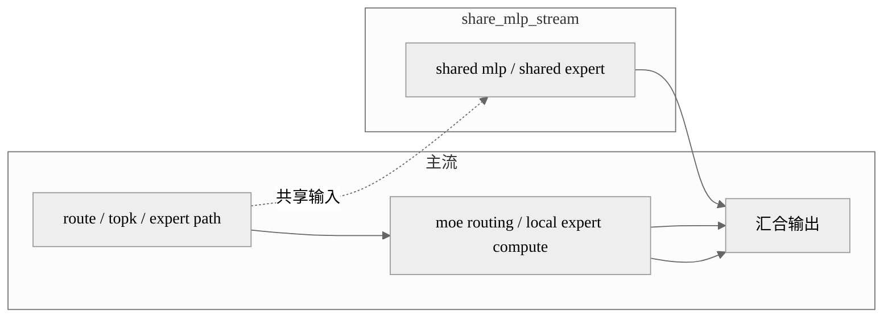

# 案例：HunyuanImage-3.0 MoE 多流变体

## 概述

这个案例解决的是多模态模型中共享 MLP 与路由路径串行执行的问题。做法是为 shared MLP 单独创建一条 NPU stream，让它与 MoE 主路径形成 overlap，最适合 HunyuanImage-3.0 这类带 MoE 结构的多模态模型。

## 背景与问题

HunyuanImage-3.0 的优化不只在 LLM 路径，还要兼顾多模态整体链路。MoE 部分如果仍然按单流执行，共享 MLP 的计算会暴露在关键路径上，影响整网时延。

相比通用的 `npu_stream_switch` 路径，这个案例更像“显式创建共享流并把它注入模块”，是另一种更直接的实现风格。

## 核心思路

- 模型初始化阶段就创建 `share_mlp_stream`。
- 在 MoE 模块中把这条流当作 shared MLP 的执行流。
- 路由专家主路径继续按原逻辑执行。
- 通过这种方式把多模态模型里的共享分支从主流剥离出去。

## 执行编排图



## 关键代码

第一段代码展示模块会持有一条 shared stream：

```python
self.share_mlp_stream = kwargs.get(
    "share_mlp_stream",
    torch.npu.Stream(device=torch.device(f"npu:{torch.npu.current_device()}"))
)
```

第二段代码展示模型初始化时直接把这条流传给各层：

```python
kwargs["share_mlp_stream"] = torch.npu.Stream(device=torch.device(f"npu:{local_rank}"))
self.layers = nn.ModuleList(
    [HunyuanImage3DecoderLayer(config, layer_idx, **kwargs) for layer_idx in range(config.num_hidden_layers)]
)
```

这种写法说明多流不是后期局部插入，而是初始化阶段就把“共享流”作为模块能力的一部分。

## 复用参考

- 代表实现：HunyuanImage-3.0。
- 相似实现：与通用 LLM 的共享专家双流思想一致。
- 特化实现：实现风格更偏“初始化注入 stream”，而不是临时切上下文。

## 注意事项

- 这类案例的多流设计更深地进入模块初始化，不适合简单拷贝一段前向代码。
- 多模态路径中如果还有 CFG、VAE 并行等其他优化，要注意资源竞争。

## 关键词

`torch.npu.Stream` `share_mlp_stream` `HunyuanImage-3.0` `MoE` `shared mlp`
