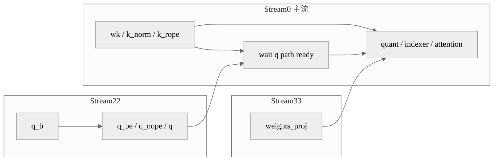

# 案例：Indexer Prolog 多流并行

## 概述

这个案例解决的是 Lightning Indexer 前处理链路串行过长的问题。做法是把 Q 路径和权重投影路径拆到不同 tagged stream 中执行，让前处理阶段出现 overlap，最适合 Attention 前处理或 Prolog 类算子链的时延优化。

## 背景与问题

Indexer Prolog 往往由多个前处理算子组成，例如线性投影、RoPE、量化和权重路径准备。如果全部堆在主流上，前处理会形成一个很长的串行段，后续 attention 计算即使再快，也要等前面的准备工作全部完成。

这类场景适合多流的原因在于：

- Q 路径和部分权重路径之间可形成局部并行窗口。
- 前处理中既有 Cube 类算子，也有 Vector / quant 路径，容易形成硬件互补。
- 只要同步点设计得当，就不会改变后续 attention 的输入语义。

## 核心思路

- 使用一条副流先跑 `q_b` 和 Q 相关预处理。
- 再用另一条流提前跑 `weights_proj`。
- 在进入后续 quant 或 attention 前，通过 `wait_tensor` 或 tagged event 保证依赖满足。
- 这种写法本质上是“前处理切流”，而不是完整的双网络并行。

## 执行编排图



## 关键代码

第一段代码展示 Q 路径被放到 `"22"` 号流里：

```python
enable_multi_streams = self.enable_multi_streams and not is_prefill

with npu_stream_switch(enable_multi_streams, "22"):
    if enable_multi_streams:
        tng.scope.npu_wait_tensor(qr, query_states[0])
    q_b = self.wq_b(qr, c8_input_dict.get("pertoken_scale", None))
    q = q_b.view(bsz, seqlen, self.n_heads, self.head_dim)
    q_pe, q_nope = torch.split(q, [self.rope_head_dim, self.head_dim - self.rope_head_dim], dim=-1)
    q_pe = torch_npu.npu_rotary_mul(q_pe.view(-1, self.n_heads, 1, self.rope_head_dim), cos, sin)
    q = torch.cat([q_pe.view(bsz, -1, self.n_heads, self.rope_head_dim), q_nope], dim=-1)
```

第二段代码展示 `weights_proj` 提前在 `"33"` 号流里执行：

```python
with npu_stream_switch(enable_multi_streams, "33"):
    if enable_multi_streams:
        tng.scope.npu_wait_tensor(x, q_b)
    weights = self.weights_proj(x.view(-1, self.dim))
```

如果图模式开启，常会配合 tagged stream event：

```python
if enable_multi_streams and self.enable_aclgraph:
    tng.ops.npu_record_tagged_stream(qr, "22")
    tng.ops.npu_tagged_event_record(indexer_npu_events[0])
```

## 复用参考

- 代表实现：DeepSeek-V3.2-Exp。
- 相似实现：GLM-5。
- 特化实现：和 MoE 双流不同，这类案例通常不直接并行完整模块，而是拆分前处理子链。

## 注意事项

- 前处理切流后，同步点设计不清楚时最容易出现输入未准备好的问题。
- 如果 `q_b`、`weights_proj` 之间实际共享更多隐藏依赖，盲目切流会导致图编译失败或精度问题。
- 图模式下要统一 stream tag 的编号和事件生命周期。

## 关键词

`npu_stream_switch` `Indexer Prolog` `weights_proj` `q_b` `wait_tensor` `tagged stream`
