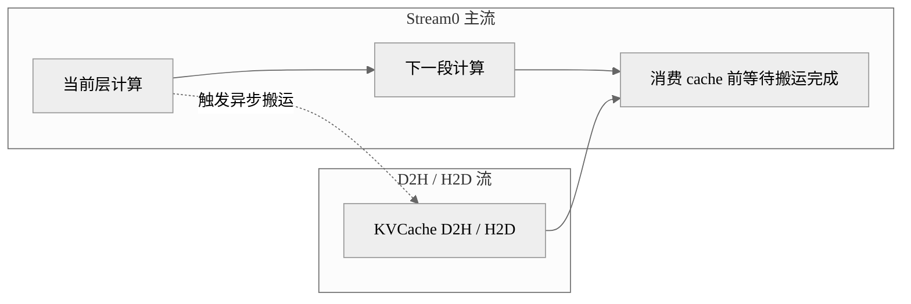

# 案例：KVCache Offload 异步搬运流

## 概述

这个案例解决的是长序列场景下 KVCache 占用高、设备内存紧张以及 cache 搬运阻塞主计算流的问题。做法是把 KVCache 的 D2H/H2D 搬运放到独立流中执行，最适合需要做 Offload 的长序列高吞吐场景。

## 背景与问题

当 KVCache 很大时，单纯依赖设备内存会限制 batch size 和可支持的序列长度。Offload 能缓解内存压力，但如果搬运直接塞在主流里，就会显著阻塞计算路径，导致 Offload 反而把时延拉高。

因此，这类优化的重点不是“有没有 Offload”，而是“Offload 是否异步、是否能和计算并行”。

## 核心思路

- 主流继续执行模型前向。
- 单独创建一条搬运流处理 KVCache 的 D2H 或 H2D。
- 用 event 协调主流和搬运流的读写边界。
- 在逻辑上把 Offload 视为一条 memory pipeline，而不是普通计算流。

## 执行编排图



## 关键代码

最核心的是给 OffloadCache 单独创建一条搬运流和事件：

```python
self.d2h_stream = torch.npu.Stream(device="npu")
self.d2h_event = torch.npu.Event(blocking=True, enable_timing=False)
```

在初始化缓存时，常见逻辑是同时维护设备侧临时 cache 和可交换内存：

```python
cache_nope = torch_npu.empty_with_swapped_memory(cache_nope_shape, dtype=dtype, device=cache_device)
selected_nope = torch.zeros((self.selection_num_blocks, self.block_size, cache_last_dim),
                            dtype=dtype, device=cache_device)
```

这类代码本身不一定直接展示完整搬运过程，但它已经体现了 Offload 设计是围绕“独立缓存搬运通道”展开的。

## 复用参考

- 代表实现：DeepSeek-V3.2-Exp。
- 相似实现：GLM-5。
- 特化实现：不同模型的差异更多体现在 cache 结构和 selection 策略，不在流模型本身。

## 注意事项

- 如果 host 带宽跟不上，异步流也无法真正隐藏搬运耗时。
- cache 一致性和复用状态管理比普通双流更容易出错。
- Offload 收益和 batch、topk、block size 强相关，不能机械复制。

## 关键词

`torch.npu.Stream` `OffloadCache` `KVCache Offload` `d2h_stream` `swapped_memory`
