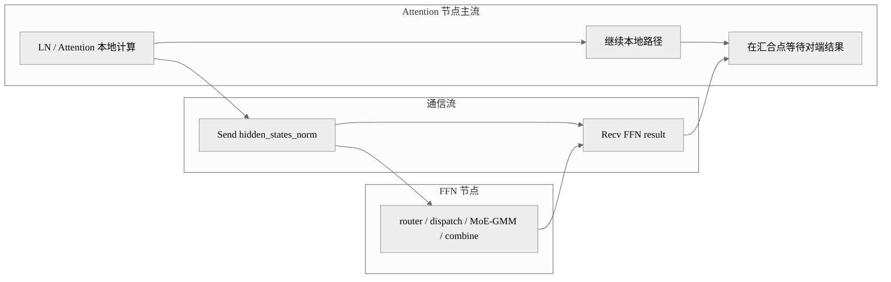

# 案例：LongCat-Flash AFD 通信计算 overlap

## 概述

这个案例解决的是 Attention-FFN Disaggregation 之后跨节点 Send/Recv 暴露在关键路径上的问题。做法是在分离部署后让通信流和主计算流 overlap，最适合 AFD 场景下的低时延优化；这个案例的主要实现形态来自模型设计与文档编排。

## 背景与问题

在非分离场景里，Attention 和 FFN 在同卡上通过多流加控核获得收益；但做了 AFD 之后，MoE 模块被剥离到另一侧节点，新的瓶颈就变成了跨节点的 Send/Recv。如果这部分通信完全串行，Attention 侧会在等待 FFN 返回时出现明显空洞。

因此，AFD 的多流重点从“本地双计算路径并行”转变成了“通信与本地计算 overlap”。

## 核心思路

- Attention 节点保留主计算流执行本地 attention 路径。
- 额外的流承担跨节点 Send/Recv。
- FFN 节点接收后执行 router / dispatch / GMM / combine，再把结果发回。
- 主流只在真正需要消费对端结果时等待。

## 执行编排图



## 关键代码

AFD 路径里，Attention 侧的主要代码形态是先发送，再异步等待对端返回：

```python
if self.enable_afd:
    dist.send(hidden_states_norm, dst=(self.global_rank - self.ffn_world_size), tag=self.send_tag)
    shortcut_mlp_output = torch.empty_like(hidden_states)
    dist.recv(shortcut_mlp_output, src=(self.global_rank - self.ffn_world_size), tag=self.recv_tag)
```

在普通路径中，这个位置原本是本地 MoE：

```python
if not self.enable_afd:
    shortcut_mlp_output = self.mlp(hidden_states_norm, is_prefill, cur_topk_list=cur_topk_list)
```

所以 AFD 的本质是把“本地 shortcut MoE”替换为“远端 FFN 服务 + 通信 overlap”。

## 复用参考

- 代表实现：LongCat-Flash AFD。
- 相似实现：其他 PD/分离式部署场景都能借鉴“通信单独成流”的思路。
- 特化实现：LongCat-Flash 会继续结合权重预取和控核一起调优。

## 注意事项

- 这个案例的重点在整体编排，不是某一段孤立代码。
- 如果 FFN 侧本身成为瓶颈，通信 overlap 也无法完全消除拖尾。
- 集群网络、Send/Recv 实现和 SDMA 行为会显著影响收益。

## 关键词

`AFD` `dist.send` `dist.recv` `overlap` `Send/Recv` `通信计算并行`
