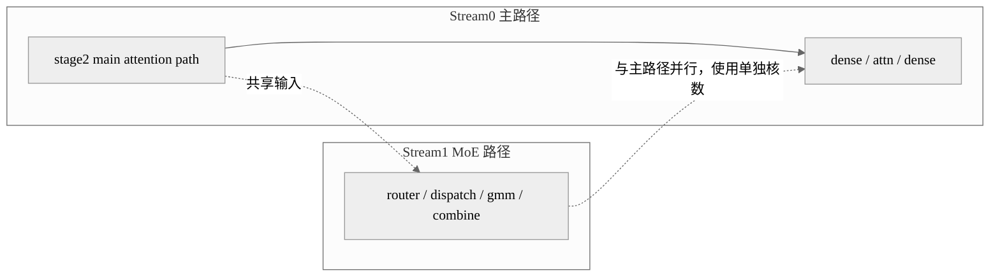

# 案例：LongCat-Flash 多流与控核联动

## 概述

这个案例解决的是 LongCat-Flash Stage2 中双路径并行时“有 overlap 但仍有明显拖尾”的问题。做法是把 Attention 路径和 MoE/FFN 路径放到不同流中，同时用 `limit_core_num` 给不同流分配不同核数，让两条流时长更接近，最适合 decode 阶段的低时延优化。

## 背景与问题

单纯多流并行并不一定稳定获益，因为一个流可能吃掉过多 Core，另一个流即使被切出去也跑不起来。LongCat-Flash 的特点在于双路径都很重，如果不控核，就容易出现一个流拖尾、另一个流提前结束，整体关键路径仍然长。

因此，这个案例的关键不是“多流”本身，而是“多流之后还要分核”。

## 核心思路

- 主流跑 dense / attention 主路径。
- 副流提前执行 shortcut MoE 路径。
- 通过 `limit_core_num(True, aic, aiv)` 给两个流分配不同的 AI Core / Vector Core 数量。
- 必要时叠加 `npu_prefetch` 和 superkernel，让双流窗口更完整。

## 执行编排图



## 关键代码

第一段代码展示 decode 阶段进入多流分支：

```python
if (self.enable_multi_stream > 0) and not is_prefill:
    return self.multi_stream_forward(
        hidden_states,
        kv_len,
        actual_seq_lengths_kv,
        position_embeddings=position_embeddings,
        attention_mask=attention_mask,
        position_ids=position_ids,
        past_key_value=past_key_value,
        is_prefill=is_prefill,
        slot_mapping=slot_mapping,
        past_residual=past_residual,
        cur_topk_list=cur_topk_list,
        next_layer=next_layer,
    )
```

第二段代码是核心并行段：把 shortcut MoE 放到副流，并单独控核：

```python
if not self.enable_afd:
    npu_prefetch(self.enable_prefetch, self.mlp.router.classifier.weight.data, o_proj, 18 * 1024 * 1024, 0)
    with npu_stream_switch(True, "1"):
        with limit_core_num(True, self.aic_num1, self.aiv_num1):
            shortcut_mlp_output = self.mlp(hidden_states_norm, is_prefill, cur_topk_list=cur_topk_list)
```

主路径继续在另一套核数配置下运行：

```python
with limit_core_num(not self.enable_afd, self.aic_num2, self.aiv_num2):
    hidden_states, _, dsq = self.mlps[0](hidden_states_norm, self.enable_prefetch, o_proj)
    hidden_states, residual = self.input_layernorm[1](hidden_states, residual)
    hidden_states, o_proj = self.self_attn[1].fused_infer_attention_score(
        query_states=query_states,
        k_nope=k_nope,
        k_rope=k_rope,
        attention_mask=attention_mask,
        actual_seq_lengths_kv=actual_seq_lengths_kv,
    )
```

## 复用参考

- 代表实现：LongCat-Flash。
- 相似实现：别的模型可以复用“多流后再分核”的思想，但核数配置要重调。
- 特化实现：AFD 场景会把通信 overlap 也纳入设计。

## 注意事项

- 多流但不控核，收益可能会被拖尾抵消。
- 控核参数不是通用值，要结合 profile 调整。
- prefetch、superkernel、控核、多流四者在这个案例里是耦合设计，拆开后收益可能不成立。

## 关键词

`npu_stream_switch` `limit_core_num` `npu_prefetch` `decode` `shortcut_mlp_output`
