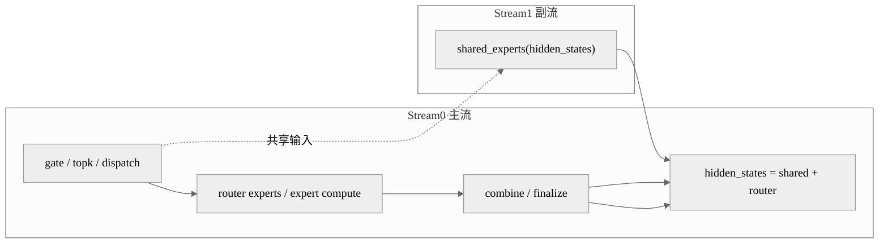

# 案例：MoE 共享专家双流并行

## 概述

这个案例解决的是 MoE decode 路径中共享专家与路由专家串行执行的问题。做法是把共享专家放到副流，让它与 gating、dispatch、路由专家计算重叠执行，最适合 `decode` 阶段的 MoE 低时延优化。

## 背景与问题

在 MoE 场景里，共享专家通常和路由专家路径一起参与最终输出，但两者并不总是严格串行依赖。如果仍然按单流顺序执行，就会把共享专家的耗时完整暴露在关键路径上，降低吞吐和 TPOT 表现。

这类场景之所以适合多流，是因为：

- 共享专家计算和路由专家主路径存在可重叠窗口。
- gating 与 dispatch 往往更偏轻量或通信型，不一定吃满全部计算资源。
- decode 阶段 shape 稳定，容易让多流收益稳定落下来。

## 核心思路

- 主流负责路由专家主路径。
- 副流负责共享专家前向。
- 在需要汇合输出的位置再做同步或事件等待。
- 如果开启图模式，还可以叠加 tagged stream 和 `stream-fusion` 进一步降低调度开销。

## 执行编排图



## 关键代码

这一段展示最小的流切换形态，核心是把共享专家放进副流：

```python
if self.n_shared_experts > 0:
    enable_multi_streams = self.enable_multi_streams and not is_prefill
    with npu_stream_switch(enable_multi_streams, "11"):
        hidden_states_share = self.shared_experts(
            hidden_states.view(-1, hidden_states.shape[-1])
        )
```

如果叠加 ACL graph event，常见写法会在切流前后记录和等待 tagged event：

```python
if use_aclgraph_event:
    tng.ops.npu_record_tagged_stream(hidden_states, "11")
    tng.ops.npu_tagged_event_record(moe_npu_events[0])

with npu_stream_switch(enable_multi_streams, "11"):
    if use_aclgraph_event:
        tng.ops.npu_tagged_event_wait(moe_npu_events[0])
    hidden_states_share = self.shared_experts(hidden_states.view(-1, hidden_states.shape[-1]))
    if use_aclgraph_event:
        tng.ops.npu_tagged_event_record(moe_npu_events[1])
```

图模式下通常还会给 superkernel 打开多流融合选项：

```python
label = "decode_layer"
option = "stream-fusion=1" if self.enable_multi_streams else "option_xxx2"
with superkernel_scope(self.enable_superkernel and not is_prefill, label, option):
    ...
```

## 复用参考

- 代表实现：DeepSeek-V3.2-Exp。
- 相似实现：DeepSeek-R1、Kimi-K2-Thinking、GLM-5。
- 特化实现：Qwen3-Next Patch 会把 shared expert stream 做成框架侧封装。

## 注意事项

- 流间依赖如果没处理好，最终 `shared + router` 会出现精度或同步错误。
- shape 太小、host bound 太重时，多流收益可能不明显。
- 开启图模式后，stream tag、event 和 superkernel scope 要一起设计，不能只切流不做同步。
- 如果共享专家本身已经吃满资源，多流不一定能带来正收益。

## 关键词

`npu_stream_switch` `shared_experts` `stream-fusion` `tagged_event` `decode` `MoE`
