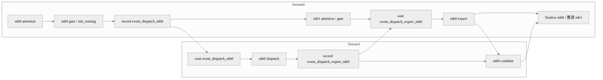

# 案例：Prefill Micro-Batch 双流流水

## 概述

这个案例解决的是 prefill 阶段“计算和通信串行，通信空洞明显”的问题。做法是把输入拆成两个 micro-batch，让两条流分别承载不同 micro-batch，并通过 `record_event` / `wait_event` 把 dispatch、expert、combine 等阶段流水化，最适合计算和通信都比较重的 prefill 场景。

## 背景与问题

prefill 常常是计算 bound，但在大模型的 EP 场景里，MoE 的 dispatch 和 combine 也会带来显著通信开销。如果这些阶段完全串行，芯片在等待通信或等待计算时都会出现空洞，造成端到端吞吐下降。

把 prefill 切成两个 micro-batch 后，虽然单次 shape 会变化，但如果计算和通信的线性度足够好，就能用一条流做当前 micro-batch 的计算，用另一条流穿插上一个或下一个 micro-batch 的通信，从而实现通信隐藏。

## 核心思路

- 创建主流 `cur_stream` 和副流 `stream1`。
- micro-batch 0 和 micro-batch 1 在不同流上生成输入。
- Attention、gate、dispatch、expert、combine、finalize 不再线性执行，而是借助 event 形成流水。
- 这种案例的重点不是“简单双流”，而是“多阶段事件编排”。

## 执行编排图



## 关键代码

第一段代码是双流入口，最核心的是先创建副流：

```python
self.micro_batch_mode = MicroBatchMode(...)
if self.micro_batch_mode != MicroBatchMode.DISABLE:
    self.stream1 = torch.npu.Stream()
```

第二段代码展示最基础的两条流分别处理两个 micro-batch：

```python
cur_stream = torch.npu.current_stream()

with torch.npu.stream(cur_stream):
    hidden_states_mb0, residual_mb0, _, cos_sin_mb0, slot_mapping_mb0, actual_seq_lengths_kv_mb0 = \
        self.prepare_inputs_for_layer(input_ids_mb0, kv_len_mb0, position_ids, actual_seq_lengths_kv_mb0, is_prefill)

with torch.npu.stream(self.stream1):
    hidden_states_mb1, residual_mb1, _, cos_sin_mb1, slot_mapping_mb1, actual_seq_lengths_kv_mb1 = \
        self.prepare_inputs_for_layer(input_ids_mb1, kv_len_mb1, position_ids, actual_seq_lengths_kv_mb1, is_prefill)
```

第三段代码展示事件驱动的 dispatch/expert/combine 流水：

```python
event_routing_dispatch_mb0 = cur_stream.record_event()

with torch.npu.stream(self.stream1):
    self.stream1.wait_event(event_routing_dispatch_mb0)
    tokens_per_expert_group_mb0, gathered_tokens_mb0, gathered_pertoken_scale_mb0, input_splits_mb0, \
        output_splits_mb0 = decode_layer.forward_dispatch_double_routing(
            tokens_per_expert_mb0, expanded_x_mb0, pertoken_scale_mb0
        )
    event_dispatch_expert_mb0 = self.stream1.record_event()

cur_stream.wait_event(event_dispatch_expert_mb0)
new_x_mb0 = decode_layer.forward_expert(
    gathered_tokens_mb0, tokens_per_expert_group_mb0, gathered_pertoken_scale_mb0
)
event_expert_combine_mb0 = cur_stream.record_event()
```

## 复用参考

- 代表实现：DeepSeek-R1 prefill。
- 相似实现：其他 EP + micro-batch 场景可参考其事件编排方式。
- 特化实现：SP-TP-EP 与 DP-EP 可能采用不同流水版本。

## 注意事项

- shape 切半后如果算子性能显著劣化，双流可能收益变差。
- event 顺序稍有错误就可能造成死等、早读或精度异常。
- 双流只是手段，真正关键是 dispatch、expert、combine 的排列顺序。

## 关键词

`torch.npu.Stream` `record_event` `wait_event` `micro-batch` `dispatch` `combine`
