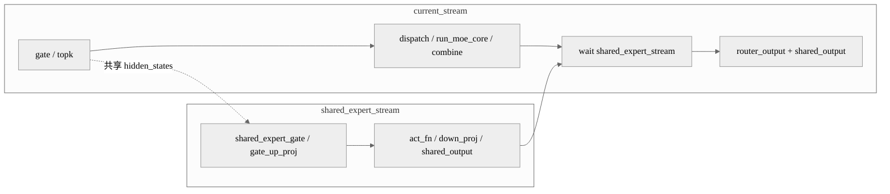

# 案例：Qwen3-Next Patch 形态的 MoE 双流

## 概述

这个案例解决的是 Qwen3-Next 在 SGLang / DeePEP 路径中 shared expert 与路由过程串行的问题。做法是在 patch 中显式引入一条 `shared_expert_stream`，让 shared expert 前向与 routing、dispatch、combine 形成 overlap，最适合框架 patch 级的 NPU 特化改造；这个案例的主要实现形态来自 patch。

## 背景与问题

当优化不是直接发生在模型仓内部，而是通过框架 patch 落地时，多流改造往往要嵌入现有 runtime 流程里。Qwen3-Next 的这个案例就是如此：它需要在 SGLang 的 MoE 逻辑里插入 NPU 专用的 shared stream，同时保持 DeePEP 的专家派发流程不变。

## 核心思路

- 用全局 helper 获取或复用 `shared_expert_stream`。
- 通过环境变量控制是否启用 NPU DeePEP MoE 多流。
- 在 `npu_forward_normal_dual_stream` 中，shared expert 与 dispatcher/combine 主路径交叉执行。
- 在最终输出前通过 `current_stream.wait_stream(shared_expert_stream)` 汇合。

## 执行编排图



## 关键代码

第一段代码是 patch 提供的 shared stream 获取函数：

```python
def get_npu_shared_expert_stream():
    global shared_expert_stream
    if shared_expert_stream is None:
        shared_expert_stream = torch.npu.Stream()
    return shared_expert_stream
```

第二段代码通过环境变量决定是否走双流：

```python
self.enable_npu_deepep_moe_multi_stream = get_bool_env_var(
    "ENABLE_NPU_DEEPEP_MOE_MULTI_STREAM", "false"
)

if _is_npu and self.shared_expert is not None and self.enable_npu_deepep_moe_multi_stream:
    shared_expert_stream = get_npu_shared_expert_stream()
    final_hidden_states, shared_output = self.npu_forward_normal_dual_stream(
        hidden_states, forward_batch, shared_expert_stream
    )
```

第三段代码是双流核心编排：

```python
current_stream = torch.npu.current_stream()
router_logits, _ = self.gate(hidden_states)
shared_expert_stream.wait_stream(current_stream)

with torch.npu.stream(shared_expert_stream):
    hidden_states_copy = hidden_states.clone()
    shared_output = self.shared_expert_gate(hidden_states_copy)
    gate_up, _ = self.shared_expert.gate_up_proj(hidden_states_copy)

dispatch_output = self.experts.dispatcher.dispatch(hidden_states=hidden_states, topk_output=topk_output)
combine_input = self.experts.run_moe_core(dispatch_output)

with torch.npu.stream(shared_expert_stream):
    shared_output = F.sigmoid(shared_output)
    gate_up = self.shared_expert.act_fn(gate_up)
    shared_expert_output, _ = self.shared_expert.down_proj(gate_up)
    shared_output = shared_output * shared_expert_output

router_output = self.experts.dispatcher.combine(combine_input=combine_input)
current_stream.wait_stream(shared_expert_stream)
```

## 复用参考

- 代表实现：Qwen3-Next SGLang patch。
- 相似实现：通用 MoE 共享专家双流案例。
- 特化实现：这里更强调 patch 接口与框架内 runtime 的兼容，而不是模型本体改造。

## 注意事项

- patch 形态案例最容易受上游框架版本变化影响。
- `hidden_states.clone()` 这类处理可能带来额外内存开销，需要结合收益评估。
- 双流逻辑要和 dispatcher / combine 生命周期对齐，否则容易出现等待顺序错误。

## 关键词

`torch.npu.Stream` `shared_expert_stream` `wait_stream` `patch` `DeePEP` `Qwen3-Next`
