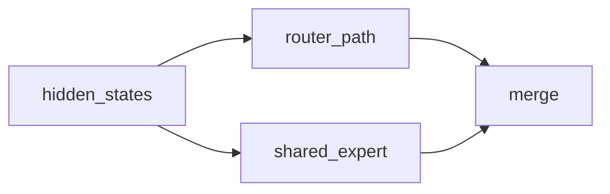
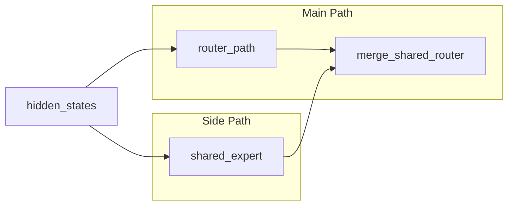

# AI Agent 整网模块拆解规范

本文用于指导 AI agent 分析多流优化。流程分两层：

1. **整网模块拆解**
   目标：把整网拆成模块，画出模块级 DAG，判断模块与模块哪些能并行。
2. **每个模块的算子级拆解**
   目标：对每个模块继续拆成算子，画出模块内算子 DAG，判断模块内哪些算子能并行。

当前文档同时约束这两层，但第一层优先。

## 总目标

agent 必须完成下面 4 件事：

- 把整网的中的一种层拆成一组模块
- 画出单层模块 DAG
- 判断模块与模块哪些能并行
- 对每个模块继续拆成算子并判断模块内算子并行性

## 输出物

分析完成后，必须产出：

1. 模块清单
2. 模块依赖清单
3. 模块 Mermaid DAG
4. 模块级并行性结论

此处分析完成后，必须补充：

1. 每个模块的算子清单
2. 每个模块的算子级依赖清单
3. 每个模块的算子级 Mermaid DAG
4. 每个模块内部的算子并行性结论

## 固定产物地址与模板

分析结果统一输出为一个 Markdown 文件，放在：

`cann-recipes-infer/docs/common/multi-stream-analysis/<network_or_case_name>.md`

命名规则：

- 使用小写英文、短横线连接
- 名字描述“整网分析对象”，不要只写某个局部函数名
- 示例：
  - `cann-recipes-infer/docs/common/multi-stream-analysis/deepseek-r1-decode.md`
  - `cann-recipes-infer/docs/common/multi-stream-analysis/longcat-flash-decode.md`
  - `cann-recipes-infer/docs/common/multi-stream-analysis/hunyuanimage3-moe-path.md`

模板文件固定放在：

`./analysis-template.md`

agent 输出时必须：

1. 基于该模板生成结果
2. 保留模板的一级、二级标题结构
3. 先写整网模块分析，再写每个模块的算子分析
4. Mermaid 图直接内嵌在结果文件中

## 一、整网模块拆解规则

### 1. 拆的是整网，不是局部函数

第一步必须从**整网执行路径**出发，而不是直接抓某个局部热点函数。

agent 要先回答这 3 个问题：

- 整网主路径从哪里开始，到哪里结束
- 当前分析的是 `prefill` 还是 `decode`
- 整网里有哪些模块

如果这一步还没完成，就不能直接进入某个局部模块内部。

### 2. 模块定义

模块必须同时满足下面 4 条：

1. 语义完整  
   例如 `Embedding`、`Attention Main Path`、`Router Path`、`Shared Expert`、`Dispatch`、`Expert Compute`、`Combine`、`KVCache Offload`、`LM Head`

2. 输入输出明确  
   能说清该模块吃什么、产什么、是否写共享状态

3. 可独立讨论调度  
   可以单独判断“是否可能和别的模块并行”

4. 尺度合适  
   不能只是局部 reshape、cast、view 或某个融合算子内部的小步骤，也不是 Decoder Layer、Attention Block、Moe Block这种大模块。

### 3. 模块优先沿这些边界拆

- 子网络边界：`Attention`、`MoE`、`MLP`、`LM Head`
- 通信边界：`all_to_all`、`send/recv`、`all_gather`、`reduce_scatter`
- 状态边界：`KVCache update`、`offload`、`reload`
- 同步边界：`record_event / wait_event`、`wait_stream`
- 资源边界：明显偏计算、偏通信、偏搬运的切换点

### 4. 第一层不要过早拆成算子

第一层不要把下面内容单独当模块：

- reshape / cast / view
- 融合算子内部步骤
- 没有调度意义的局部前后处理

第一层的目标只是把整网骨架立起来，并回答模块与模块之间的并行关系。

## 二、整网模块 DAG 规则

### 1. 节点

- 一个节点对应一个一级模块
- 节点名要体现模块语义，不要用代码行名
- 汇合点可以单独画成控制节点，例如 `merge_shared_router`

### 2. 边类型

每条边必须标注依赖类型，只允许下面 4 类：

- `data`
  后继模块直接消费前驱模块输出
- `state`
  后继模块依赖前驱写完 cache、buffer 或共享状态
- `event`
  后继模块依赖前驱的事件、同步或 stream wait
- `collective_order`
  通信顺序固定，不能随意重排

### 3. 共同输入不是依赖

如果两个模块都使用同一个输入，例如 `hidden_states` 同时进入 `router_path` 和 `shared_expert`，不要把它们之间画成依赖边，而是补一个共同上游节点。

正确画法：

### 4. Mermaid 画法

- 统一使用 `flowchart LR`
- 如果还没决定流归属，用 `Main Path / Side Path / Comm Path`
- 如果代码里已经明确是 `Stream0 / Stream1`，才用流名做 `subgraph`

边规则：

- `-->`：`data` 或 `state`
- `-.->`：`event`

## 三、模块级并行性判断

### 判为 `serial`

满足任一条件就必须串行：

- 存在 `data` 依赖
- 存在共享可写状态冲突
- 通信顺序固定，不能插入
- 其中一个只是另一个内部步骤

### 判为 `parallel_candidate`

同时满足下面条件时，可以判为模块级并行候选：

- 没有 `data` 依赖
- 没有明确共享写冲突
- 两者结果在后面的汇合点才相遇
- 通信顺序没有把它们绑定成单链条

### 判为 `parallel_pending_validation`

逻辑上可并行，但下面因素还没确认：

- 资源是否冲突
- shape 是否太小
- 图模式或 runtime 是否有限制
- 是否会引入额外 clone / buffer / host 开销

## 四、算子级拆解规则

第二层不是只分析部分模块，而是**每个模块都要继续拆成算子**。

### 1. 算子级拆解目标

对每个模块都要回答：

- 模块内部有哪些关键算子或算子组
- 算子与算子之间的 DAG 是什么
- 模块内部哪些算子能并行，哪些必须串行

### 2. 算子级拆解原则

- 仍然优先沿计算、通信、同步、状态边界拆
- 一个算子节点可以是单算子，也可以是没有必要继续拆的算子组
- 模块内的共同输入、汇合点、同步点仍然要单独标清

### 3. 算子级输出

每个模块都要补齐：

- 模块内算子清单
- 算子级依赖
- 算子级 DAG
- 模块内算子并行性结论

## 五、推荐输出格式

### 1. 整网模块清单

| module_id | module_name | module_type | inputs | outputs | side_effect | resource_hint |
| --- | --- | --- | --- | --- | --- | --- |

### 2. 整网模块依赖清单

| from | to | dependency_type | reason |
| --- | --- | --- | --- |

### 3. 整网模块 DAG

直接输出 Mermaid。

### 4. 模块级并行性结论

模块级并行性结论**不要**写成 `module_a / module_b` 的二元表，因为整网分析往往涉及：

- 多个模块同时并行
- 一个流里串行一组模块，另一个流里并行另一组模块
- 多个分叉点和多个汇合点

因此，模块级并行性结论必须直接按“分组和结构”描述，至少包含下面 4 部分：

1. `主串行链`
   说明哪些模块构成当前主路径，不能打断。

2. `可并行模块组`
   说明哪些模块可以作为一组与主路径或其他组并行。

3. `待验证模块组`
   说明逻辑可并行，但资源或运行时约束还要验证的模块组。

4. `建议流分组`
   用 `Stream0 / Stream1 / Stream2` 或 `Main Path / Side Path / Comm Path` 的方式描述推荐分组，不要求现在就和代码中的真实流一一对应。

推荐写法示例：

- 主串行链：`embedding -> attention_main -> merge -> lm_head`
- 可并行模块组：
  - 组 A：`router_path -> dispatch -> combine`
  - 组 B：`shared_expert`
- 待验证模块组：
  - 组 C：`kvcache_reload -> indexer_prolog`
- 建议流分组：
  - `Stream0`：`attention_main -> merge -> lm_head`
  - `Stream1`：`shared_expert`
  - `Stream2`：`router_path -> dispatch -> combine`

### 5. 每个模块的算子级结果

对每个模块都要补一组结果：

- 算子清单
- 算子依赖清单
- 算子级 Mermaid DAG
- 模块内算子并行性结论

算子级并行性结论也**不要**写成 `op_a / op_b` 的二元表。原因和模块级相同：模块内部同样可能是多组算子并行、多个汇合点、多个同步点。

因此，每个模块内部的算子并行性结论也必须按“分组和结构”描述，至少包含：

1. `模块内主串行链`
2. `模块内可并行算子组`
3. `模块内待验证算子组`
4. `模块内建议流分组`

推荐写法示例：

- 模块内主串行链：`qkv_prepare -> attention_score -> merge_out`
- 模块内可并行算子组：
  - 组 A：`shared_expert_gate -> shared_expert_down_proj`
  - 组 B：`router_topk -> dispatch`
- 模块内待验证算子组：
  - 组 C：`kvcache_reload -> indexer_prolog`
- 模块内建议流分组：
  - `Stream0`：`qkv_prepare -> attention_score -> merge_out`
  - `Stream1`：`shared_expert_gate -> shared_expert_down_proj`
  - `Stream2`：`router_topk -> dispatch`

实际写文件时，必须按 `./analysis-template.md` 的结构落盘。

## 六、最小示例

下面示例只演示第一层：如何把整网中的一段 MoE 路径整理成模块级局部骨架。

### 模块清单

| module_id | module_name | module_type | inputs | outputs | side_effect | resource_hint |
| --- | --- | --- | --- | --- | --- | --- |
| router_path | Router Path | compute | hidden_states | routed_hidden_states | 无 | compute + comm |
| shared_expert | Shared Expert | compute | hidden_states | shared_hidden_states | 无 | compute |
| merge_shared_router | Merge Shared Router | control | routed_hidden_states, shared_hidden_states | hidden_states | 无 | light compute |

### 依赖清单

| from | to | dependency_type | reason |
| --- | --- | --- | --- |
| router_path | merge_shared_router | data | merge 需要 routed_hidden_states |
| shared_expert | merge_shared_router | data | merge 需要 shared_hidden_states |

### Mermaid DAG

### 模块级并行性结论

- 主串行链：`router_path -> merge_shared_router`
- 可并行模块组：
  - 组 A：`shared_expert`
- 待验证模块组：
  - 无
- 建议流分组：
  - `Main Path`：`router_path -> merge_shared_router`
  - `Side Path`：`shared_expert`

## 关键词

`whole-graph decomposition` `module dag` `module parallelism` `operator dag`
