## 1. 算子精度标准定义

由于不同硬件上算子实现的差异，同样的算子用例在不同的硬件上运行，结果无法做到完全一致。为了确保下游模型训练与推理业务的数值正确性，本标准提出了一套完整的算子精度评价体系作为算子精度标准，其提供包含精度分级、测试输入规则、算子执行方案及输出结果比对方法供开发者衡量算子精度。

### 1.1 范围与应用场景

本标准面向使用昇腾产品的算子开发/测试人员，以及上下游中需要评估算子精度的框架API开发者或模型开发者。

本标准适用于如下的昇腾算子应用场景：

1. Kernel：算子最小的实现和调用单位
2. ACLNN-API：实现对Kernel的封装及组合调用，单个API包含一个或多个Kernel调用。
   
   

### 1.2 算子精度分级说明

基于算子重要性评估，本标准设计了从 L0 到 L2的分级看护体系，测试的输入规模及通过阈值（详见[浮点计算通过标准](#浮点计算通过标准)）均逐级加严。算子精度等级（以下简称精度等级）

<table style="width: 100%; border-collapse: collapse;">
  <colgroup>
    <col style="width: 12%;" />
    <col style="width: 17.6%;" />
    <col style="width: 17.6%;" />
    <col style="width: 25%;" />
    <col style="width: 27.8%;" />
  </colgroup>
  <thead>
    <tr>
      <th style="text-align: center; border: 1px solid #ddd; padding: 8px;" rowspan="2">精度等级</th>
      <th style="text-align: center; border: 1px solid #ddd; padding: 8px;" rowspan="2">等级定义</th>
      <th style="text-align: center; border: 1px solid #ddd; padding: 8px;" rowspan="2">用例规模</th>
      <th style="text-align: center; border: 1px solid #ddd; padding: 8px;" rowspan="2">浮点阈值通过标准 (MARE / MERE /RMSE)</th>
      <th style="text-align: center; border: 1px solid #ddd; padding: 8px;" rowspan="2">适用场景</th>
    </tr>
  </thead>
  <tbody>
    <tr>
      <td style="text-align: center; border: 1px solid #ddd; padding: 8px; vertical-align: middle;"><strong>L0</strong></td>
      <td style="text-align: center; border: 1px solid #ddd; padding: 8px; vertical-align: middle;">常规算子</td>
      <td style="text-align: center; border: 1px solid #ddd; padding: 8px; vertical-align: middle;">≥ 5,000</td>
      <td style="text-align: center; border: 1px solid #ddd; padding: 8px; vertical-align: middle;">≤10 / ≤2 / ≤2
      </td>
      <td style="text-align: left; border: 1px solid #ddd; padding: 8px; vertical-align: middle;">满足基本数值正确性，适用于非敏感业务</td>
    </tr>
    <tr>
      <td style="text-align: center; border: 1px solid #ddd; padding: 8px; vertical-align: middle;"><strong>L1</strong></td>
      <td style="text-align: center; border: 1px solid #ddd; padding: 8px; vertical-align: middle;">重要算子</td>
      <td style="text-align: center; border: 1px solid #ddd; padding: 8px; vertical-align: middle;">≥ 10,000</td>
      <td style="text-align: center; border: 1px solid #ddd; padding: 8px; vertical-align: middle;">≤5 / ≤1.5 / ≤1.5
      </td>
      <td style="text-align: left; border: 1px solid #ddd; padding: 8px; vertical-align: middle;">用于多模态、LLM-MOE或推荐系统等对精度有较高要求的领域</td>
    </tr>
    <tr>
      <td style="text-align: center; border: 1px solid #ddd; padding: 8px; vertical-align: middle;"><strong>L2</strong></td>
      <td style="text-align: center; border: 1px solid #ddd; padding: 8px; vertical-align: middle;">关键算子</td>
      <td style="text-align: center; border: 1px solid #ddd; padding: 8px; vertical-align: middle;">≥ 30,000</td>
      <td style="text-align: center; border: 1px solid #ddd; padding: 8px; vertical-align: middle;">≤2 / ≤1.2 / ≤1.2
      </td>
      <td style="text-align: left; border: 1px solid #ddd; padding: 8px; vertical-align: middle;">用于多模态、LLM-MOE或推荐系统业务中的关键算子，执行最严苛验收标准</td>
    </tr>
  </tbody>
</table>

### 1.3 标准的核心思想

本标准的核心验证流程包含三个关键环节。

1. 根据**用例生成规则**构建能覆盖算子典型与边界场景的测试数据。
2. 依据算子分级选取**执行策略**，分别在NPU和三方芯片上执行算子，得到两套输出结果。
3. 使用**结果比对**章节中的指标进行量化评估，判断当前算子精度是否达标。

## 2. 用例生成规则

算子的输入结构：主要是由张量（Tensor）和属性（Attr）两部分组成，在明确了精度分级体系后，测试人员需要按照算子输入的生成范围和生成规则生成对应的**测试用例**。

<table style="width: 100%;">
  <colgroup>
    <col style="width: 1%;" />
    <col style="width: 4%;" />
    <col style="width: 8%;" />
    <col style="width: 8%;" />
    <col style="width: 6%;" />
    <col style="width: 10%;" />
    <col style="width: 10%;" />
    <col style="width: 1%;" />
  </colgroup>
  <thead>
    <tr>
      <th rowspan="3" style="text-align: center; vertical-align: middle">精度等级</th>
      <th rowspan="3" style="text-align: center; vertical-align: middle">用例规模</th>
      <th colspan="5" style="text-align: center; vertical-align: middle">Tensor</th>
      <th colspan="1" style="text-align: center; vertical-align: middle">Attr</th>
    </tr>
    <tr>
      <th colspan="1" style="text-align: center; vertical-align: middle">数据类型</th>
      <th colspan="1" style="text-align: center; vertical-align: middle">数据格式</th>
      <th colspan="2" style="text-align: center; vertical-align: middle">数据维度</th>
      <th colspan="1" style="text-align: center; vertical-align: middle">数据值域分布</th>
      <th colspan="1" style="text-align: center; vertical-align: middle">参数类型</th>
    </tr>
    <tr>
      <th style="text-align: center; vertical-align: middle">生成规则</th>
      <th style="text-align: center; vertical-align: middle">生成规则</th>
      <th style="text-align: center; vertical-align: middle">生成范围</th>
      <th style="text-align: center; vertical-align: middle">生成规则</th>
      <th style="text-align: center; vertical-align: middle">分布类型</th>
      <th style="text-align: center; vertical-align: middle">生成规则</th>
    </tr>
  </thead>
  <tbody>
    <tr>
      <td style="text-align: center; vertical-align: middle"><strong>L0</strong></td>
      <td style="text-align: center; vertical-align: middle">≥ 5,000</td>
      <td style="text-align: left; vertical-align: middle">
        - 覆盖所有支持数据类型    (FLOAT16/BFLOAT16/FLOAT32等) - 数量：每种类型≥200
      </td>
      <td rowspan="3" style="text-align: left; vertical-align: middle">
        覆盖所有支持数据格式 (ND/NCHW/FRACTAL_NZ等)
      </td>
      <td rowspan="3" style="text-align: left; vertical-align: middle">
        维度数: 1-8 
        维度值: 1-231 
        总元素数 ≤ 231
      </td>
      <td style="text-align: left; vertical-align: middle">
        在支持范围内 
        - 覆盖所有维度数 
        - 维度值按步长(15,16)泛化 
      </td>
      <td style="text-align: left; vertical-align: middle">
       - 均匀分布(值域[-5, 5])：50%用例覆盖 
       - 正态分布(μ∈[-100, 100]，σ∈[1, 25])：50%用例覆盖 
      </td>
      <td rowspan="3" style="text-align: left; vertical-align: middle">
        标量：覆盖所有等价类场景 布尔：覆盖True和False 枚举：覆盖所有支持枚举值 参数类型进行组合遍历
      </td>
    </tr>
    <tr>
      <td style="text-align: center; vertical-align: middle"><strong>L1</strong></td>
      <td style="text-align: center; vertical-align: middle">≥ 10,000</td>
      <td rowspan="2" style="text-align: left; vertical-align: middle">
        - 覆盖所有支持数据类型    (FLOAT16/BFLOAT16/FLOAT32等) - 数量：每种类型≥700
      </td>
      <td style="text-align: left; vertical-align: middle">
        在支持范围内 
        - 覆盖所有维度数 
        - 维度值随机 
      </td>
      <td rowspan="2" style="text-align: left; vertical-align: middle">
        - 均匀分布(值域[-0.001, 0.001]和[-5, 5])：分别10%、30%用例覆盖 
        - 正态分布(μ∈[-100, 100]，σ∈[1, 25]))：40%用例覆盖 
        - 离群点分布(随机0.1%的值乘以1000))：20%用例覆盖 
      </td>
    </tr>
    <tr>
      <td style="text-align: center; vertical-align: middle"><strong>L2</strong></td>
      <td style="text-align: center; vertical-align: middle">≥ 30,000</td>
      <td style="text-align: left; vertical-align: middle">
        - 泛化用例基础上新增： 实际业务场景下模型训练和推理输入 
        - 泛化用例 : 模型用例 = 2:1
      </td>
    </tr>
  </tbody>
</table>

注：

1. 单个用例是指在一个明确的输入Tensor和输入Attr下，执行一次算子计算并获取其输出的单一测试项。本标准中单一测试项对于不同的随机种子产生的结果记为相同用例。
2. 数据类型、数据格式、数据维度和参数类型，用例生成需要相互正交。
3. 输出的总元素（所有测试用例输出样本点总和）数不得低于1,000,000（100万）。
4. 训练中的反向算子进行精度评估时需要使用[**正反向级联测试**](#正反向级联测试)进行精度评估。
5. 正态分布均值和标准差在范围内随机选取， 离群点分布生成规则详见"[**离群点分布生成规则**](#离群点分布生成规则)"。

### 2.1 特殊场景测试规则

<table style="width: 100%; border-collapse: collapse;">
  <colgroup>
    <col style="width: 10%;" />
    <col style="width: 20%;" />
    <col style="width: 70%;" />
  </colgroup>
  <thead>
    <tr>
      <th style="text-align: left; vertical-align: middle; padding: 12px; border: 1px solid #ddd; background-color: #f8f9fa; font-weight: bold;">算子输入</th>
      <th style="text-align: left; vertical-align: middle; padding: 12px; border: 1px solid #ddd; background-color: #f8f9fa; font-weight: bold;">特殊值场景</th>
      <th style="text-align: left; vertical-align: middle; padding: 12px; border: 1px solid #ddd; background-color: #f8f9fa; font-weight: bold;">定义</th>
    </tr>
  </thead>
  <tbody>
    <tr>
      <td rowspan="4" style="text-align: left; vertical-align: middle; padding: 12px; border: 1px solid #ddd; font-weight: bold;">Tensor</td>
      <td style="text-align: left; vertical-align: middle; padding: 12px; border: 1px solid #ddd; font-weight: bold;">空Tensor</td>
      <td style="text-align: left; vertical-align: middle; padding: 12px; border: 1px solid #ddd;">
        某个维度为0，其余维度为非负整数的Tensor；每种dtype每个dim遍历得到dim个空Tensor。
      </td>
    </tr>
    <tr>
      <td style="text-align: left; vertical-align: middle; padding: 12px; border: 1px solid #ddd; font-weight: bold;">上下边界测试</td>
      <td style="text-align: left; vertical-align: middle; padding: 12px; border: 1px solid #ddd;">
        下边界：shape的每个维度都为1的Tensor，每种dtype每个dim一个标量Tensor。 
        上边界：shape的某个维度为231+1，其余维度都为1的Tensor，每种dtype每个dim遍历得到dim个标量Tensor。
      </td>
    </tr>
    <tr>
      <td style="text-align: left; vertical-align: middle; padding: 12px; border: 1px solid #ddd; font-weight: bold;">标量Tensor测试</td>
      <td style="text-align: left; vertical-align: middle; padding: 12px; border: 1px solid #ddd;">
        shape为[1]的Tensor；每种dtype一个标量Tensor。
      </td>
    </tr>
    <tr>
      <td style="text-align: left; vertical-align: middle; padding: 12px; border: 1px solid #ddd; font-weight: bold;">输入INF/-INF/NAN测试</td>
      <td style="text-align: left; vertical-align: middle; padding: 12px; border: 1px solid #ddd;">
        所有的输入Tensor的元素值都会遍历"nan", "inf", "-inf", ["-inf", "inf"] 中的某一个，每种dtype每种元素值生成4个不同shape的用例。
      </td>
    </tr>
    <tr>
      <td style="text-align: left; vertical-align: middle; padding: 12px; border: 1px solid #ddd; font-weight: bold;">Tensor/Attr</td>
      <td style="text-align: left; vertical-align: middle; padding: 12px; border: 1px solid #ddd; font-weight: bold;">异常值覆盖</td>
      <td style="text-align: left; vertical-align: middle; padding: 12px; border: 1px solid #ddd;">
        覆盖边界值外、约束外或不支持场景有明确的防护或者拦截，包括资料说明+代码拦截。 
        1. 边界值外测试：针对超出值域边界值进行测试。  
        2. 针对算子自身约束和不支持场景进行测试。
      </td>
    </tr>
  </tbody>
</table>

注：特殊场景覆盖用例不计入用例规模。

## 3. 执行策略

基于第二章的测试输入，测试人员或开发者需要在**指定硬件平台**（见下表）上运行算子，并根据不同精度等级重复执行相应次数（**压测**），以捕获偶现的精度问题。具体压测规模与平台要求如下：

<table style="width: 100%;">
  <colgroup>
    <col style="width: 20%;" />
    <col style="width: 25%;" />
    <col style="width: 30%;" />
  </colgroup>
  <thead>
    <tr>
      <th style="text-align: center;">精度等级</th>
      <th style="text-align: center;">测试次数</th>
      <th style="text-align: center;">硬件平台覆盖要求</th>
    </tr>
  </thead>
  <tbody>
    <tr>
      <td style="text-align: center; vertical-align: top;"><strong>L0</strong></td>
      <td style="text-align: center; vertical-align: top;">单个用例执行50次</td>
      <td style="text-align: left; vertical-align: top;" rowspan="3">
        - <strong>训练</strong>： 910A、910B2、910B3、910C及后续平台 
	- <strong>推理</strong>： 910B2、910B3、310P、310B及后续平台
      </td>
    </tr>
    <tr>
      <td style="text-align: center; vertical-align: top;"><strong>L1</strong></td>
      <td style="text-align: center; vertical-align: top;">单个用例执行50次</td>
    </tr>
    <tr>
      <td style="text-align: center; vertical-align: top;"><strong>L2</strong></td>
      <td style="text-align: center; vertical-align: top;">单个用例执行1000次</td>
    </tr>
  </tbody>
</table>

注：支持确定性计算的算子，单个用例多次执行结果需一致

## 4. 结果比对

在前述章节的基础上，**由于不同计算类型算子（如整数运算与浮点运算）的误差特性存在本质差异**，无法使用统一的阈值标准。因此，本标准根据算子的计算特性将其划分为非计算类、整数计算类、量化计算类、浮点计算类共四类（[算子分类定义](#算子分类定义)），**并为每类算子制定了针对性的精度比对标准**。

### 4.1 算子类别与误差度量表

<table style="width: 100%;">
  <colgroup>
    <col style="width: 15%;" />
    <col style="width: 10%;" />    <col style="width: 15%;" />
    <col style="width: 15%;" />
    <col style="width: 15%;" />
    <col style="width: 15%;" />
  </colgroup>
  <thead>
    <tr>
      <th style="text-align: left;">算子类别/误差度量</th>
      <th style="text-align: center;">二进制一致 Bitwise Match</th>   
      <th style="text-align: center;">绝对误差 AE</th>
      <th style="text-align: center;">最大相对误差 MARE</th>
      <th style="text-align: center;">平均相对误差 MERE</th>
      <th style="text-align: center;">均方根误差 RMSE</th>
    </tr>
  </thead>
  <tbody>
    <tr>
      <td style="text-align: left;"><strong>非计算类</strong> 搬移/Cast</td>
      <td style="text-align: center;">✔</td>      <td style="text-align: center;">N/A</td>
      <td style="text-align: center;">N/A</td>
      <td style="text-align: center;">N/A</td>
      <td style="text-align: center;">N/A</td>
    </tr>
    <tr>
      <td style="text-align: left;"><strong>整数计算</strong> INT8/INT16/INT32</td>
      <td style="text-align: center;">✔</td>  
      <td style="text-align: center;">✔</td>
      <td style="text-align: center;">N/A</td>
      <td style="text-align: center;">N/A</td>
      <td style="text-align: center;">N/A</td>
    </tr>
    <tr>
      <td style="text-align: left;"><strong>量化计算</strong> FLOAT4/FLOAT8/INT8</td>
      <td style="text-align: center;">N/A</td>  
      <td style="text-align: center;">✔</td>
      <td style="text-align: center;">✔</td>
      <td style="text-align: center;">✔</td>
      <td style="text-align: center;">✔</td>
    </tr>
    <tr>
      <td style="text-align: left;"><strong>浮点计算</strong> FLOAT16/FLOAT32</td>
      <td style="text-align: center;">N/A</td>  
      <td style="text-align: center;">N/A</td>
      <td style="text-align: center;">✔</td>
      <td style="text-align: center;">✔</td>
      <td style="text-align: center;">✔</td>
    </tr>
  </tbody>
</table>

- **误差度量评价指标介绍：**

1. 二进制一致（Bitwise Match）：输出结果逐比特位对齐。
2. 绝对误差（Absolute Error，AE）：对应采样点的绝对差异。
   
   $$
   \text{AE} = \text{abs}(actual - golden)
   $$
3. 最大相对误差（Max Relative Error，MARE）：采样点中相对误差最大值。
   
   $$
   \text{MARE} = \max(\frac{\text{abs}(actual - golden)}{\text{abs}(golden)+\text{1e-7}})
   $$
4. 平均相对误差（Mean Relative Error，MERE）：采样点中相对误差平均值。
   
   $$
   \text{MERE} = \text{avg}(\frac{\text{abs}(actual - golden)}{\text{abs}(golden)+\text{1e-7}})
   $$
   
   计算相对误差的时候引入小值1e-7避免golden出现除0风险。
5. 均方根误差 (Root Mean Squared Error，RMSE)：统计误差的分布情况（集中 or 平均）。
   
   $$
   \text{RMSE} = \sqrt{\frac{1}{N}\sum^{N}_{1}(actual_{i}-golden_{i})^{2}}
   $$

- **精度比对方法介绍：**

精度验证时，需要将昇腾算子与参考实现的结果进行比对，以下提供两种比对方法：

* **双标杆比对**：以更高精度的CPU实现为“真值（Golden）”，同时评估三方芯片实现（或同精度CPU/昇腾小算子拼接实现）与昇腾实现相对于该真值的误差。
* **单标杆比对**：与单一精度标杆（CPU、三方芯片或昇腾小算子拼接）直接比较。涉及计算类的单一精度标杆应是更高精度的实现。

### 4.2 非计算类算子通过标准

**比对方法：**单标杆比对。

**通过标准：** 与真值二进制一致。

### 4.3 整数计算类算子通过标准

**比对方法：** 单标杆比对。

**通过标准：**与真值二进制一致。当二进制不一致但绝对误差为0时，也视为通过。

### 4.4 量化计算类算子通过标准

量化类算子存在两种输出模式：量化结果输出（整型输出）或反量化结果输出（浮点输出）。
**比对方法：** 单标杆比对（整型输出） / 双标杆比对（浮点输出）。

**通过标准：**

<table style="width: 100%;  border: 1px solid #ddd;">
  <colgroup>
    <col style="width: 10%;" />
    <col style="width: 45%;" />
    <col style="width: 45%;" />
  </colgroup>
  <thead>
    <tr style="background-color: #f2f2f2;">
      <th style="text-align: center; border: 1px solid #ddd; padding: 8px;">输入类型 \ 输出类型</th>
      <th style="text-align: center; border: 1px solid #ddd; padding: 8px;">整型输出 (INT4/INT8/INT16 等)</th>
      <th style="text-align: center; border: 1px solid #ddd; padding: 8px;">浮点输出 (FLOAT4/FLOAT8/FLOAT16 等)</th>
    </tr>
  </thead>
  <tbody>
    <tr>
      <td style="border: 1px solid #ddd; padding: 8px; text-align: center; font-weight: bold; background-color: #f8f9fa;">
        整型输入 (INT4/INT8 等)
      </td>
      <td style="border: 1px solid #ddd; padding: 8px; text-align: center;">
        N/A  
      </td>
      <td style="border: 1px solid #ddd; padding: 8px; text-align: center;">
        参考浮点精度标准 
      </td>
    </tr>
    <tr>
      <td style="border: 1px solid #ddd; padding: 8px; text-align: center; font-weight: bold; background-color: #f8f9fa;">
        浮点输入 (FLOAT4/FLOAT8/FLOAT16 等)
      </td>
      <td style="border: 1px solid #ddd; padding: 8px; text-align: center;">
        绝对误差 ≤ 1 
      </td>
      <td style="border: 1px solid #ddd; padding: 8px; text-align: center;">
        参考浮点精度标准 
      </td>
    </tr>
  </tbody>
</table>

### 4.5 浮点计算通过标准

浮点数的计算场景输出使用最大相对误差，平均相对误差和均方根误差三个关键指标。

**比对方法：**双标杆比对
注：当没有竞品对标场景（如自定义算子、非标准算子）时，可以使用**小算子拼接实现**或**自行构造的CPU实现**。

#### 4.5.1 正常值域通过标准

**定义误差比值（Ratio）**：`Ratio = NPU误差指标 / 三方芯片误差指标`。用于量化NPU相对于标杆（三方芯片）的精度表现。
**通过标准：**

<table style="width: 100%">
  <colgroup>
    <col style="width: 20%;" />
    <col style="width: 26.67%;" />
    <col style="width: 26.67%;" />
    <col style="width: 26.67%;" />
  </colgroup>
  <thead>
    <tr>
      <th style="text-align: center;">等级</th>
      <th style="text-align: center;">最大相对误差比 (MARE_npu / MARE_三方芯片)</th>
      <th style="text-align: center;">平均相对误差比 (MERE_npu / MERE_三方芯片)</th>
      <th style="text-align: center;">均方根误差比 (RMSE_npu / RMSE_三方芯片)</th>
    </tr>
  </thead>
  <tbody>
    <tr>
      <td style="text-align: center; vertical-align: top;"><strong>L0</strong></td>
      <td style="text-align: center; vertical-align: top;">≤ 10</td>
      <td style="text-align: center; vertical-align: top;">≤ 2.0</td>
      <td style="text-align: center; vertical-align: top;">≤ 2.0</td>
    </tr>
    <tr>
      <td style="text-align: center; vertical-align: top;"><strong>L1</strong></td>
      <td style="text-align: center; vertical-align: top;">≤ 5</td>
      <td style="text-align: center; vertical-align: top;">≤ 1.5</td>
      <td style="text-align: center; vertical-align: top;">≤ 1.5</td>
    </tr>
    <tr>
      <td style="text-align: center; vertical-align: top;"><strong>L2</strong></td>
      <td style="text-align: center; vertical-align: top;">≤ 2</td>
      <td style="text-align: center; vertical-align: top;">≤ 1.2</td>
      <td style="text-align: center; vertical-align: top;">≤ 1.2</td>
    </tr>
  </tbody>
</table>

`inf`,`-inf`,`nan`值，需要参考 [INF、NAN通过标准](#INF、NAN通过标准)

#### 4.5.2 复检说明

当算子单个用例执行不满足通过标准时需启动算子复检流程，目的是为了**避免数值不稳定性带来的精度误差影响**。本标准采用基于统计中位数置信区间的统计学办法判断精度是否通过。

- **测试方法：**
  
  - **采样**：更换不同的随机种子重新生成输入并执行`N`次（推荐1000次）。
  - **统计量计算**：计算误差比值的中位数（Median）。
  - **置信区间计算**：按照"[置信区间计算说明](#置信区间计算说明)" 的方法计算95%置信区间。相关工程可参考"[复检工具](#复检工具)"，相关理论可参考"[复检统计学理论说明](#复检统计学理论说明)"。

$$
\left[CI_{Lower},\ CI_{Upper}\right] = \left[Q_{0.025}(\{M_i\}_{i=1}^N),\ Q_{0.975}(\{M_i\}_{i=1}^N)\right]
$$

* `{M_i}` 为N次bootstrap重采样的中位数集合。
* `Qₚ` 表示p分位数函数。
* 对于N=1000次重采样，具体计算为：`CI_Lower` = 第25小的中位数，`CI_Upper` = 第976小的中位数。

- **通过标准：**
  
  - **前置规则**：若单个用例重新运行的测试执行次数 **`N < 200`**，则直接判定为 **不通过**，见“[小样本熔断机制说明](#小样本熔断机制说明)”。
  - **判定规则**：若置信区间下限 **`CI_Lower > 1.0`**，则判定为 **不通过**，置信区间完全位于1.0右侧说明有统计学证据表明NPU存在系统性精度恶化。

#### 4.5.3 小值域通过说明

当算子输出结果为极小值（接近0）时，相对误差计算可能不稳定，因此需要使用小值域通过标准评估精度。

- **小值域阈值对应表：**
  
  <table style="width: 120%; border-collapse: collapse;">
    <colgroup>
      <col style="width: 25%;" />
      <col style="width: 12.5%;" />
      <col style="width: 12.5%;" />
      <col style="width: 12.5%;" />
      <col style="width: 12.5%;" />
      <col style="width: 12.5%;" />
      <col style="width: 12.5%;" />
    </colgroup>
    <thead>
      <tr>
        <th style="text-align: center; border: 1px solid #ddd; padding: 8px;">指标类型</th>
        <th style="text-align: center; border: 1px solid #ddd; padding: 8px;"><strong>FLOAT16</strong></th>
        <th style="text-align: center; border: 1px solid #ddd; padding: 8px;"><strong>BFLOAT16</strong></th>
        <th style="text-align: center; border: 1px solid #ddd; padding: 8px;"><strong>FLOAT32</strong></th>
        <th style="text-align: center; border: 1px solid #ddd; padding: 8px;"><strong>HiFLOAT32</strong></th>
        <th style="text-align: center; border: 1px solid #ddd; padding: 8px;"><strong>FLOAT8 E4M3</strong></th>
        <th style="text-align: center; border: 1px solid #ddd; padding: 8px;"><strong>FLOAT8 E5M2</strong></th>
      </tr>
    </thead>
    <tbody>
      <tr>
        <td style="text-align: center; border: 1px solid #ddd; padding: 8px;"><strong>小值域阈值 (Small Value Threshold)</strong></td>
        <td style="text-align: center; border: 1px solid #ddd; padding: 8px;">2-11</td>
        <td style="text-align: center; border: 1px solid #ddd; padding: 8px;">2-8</td>
        <td style="text-align: center; border: 1px solid #ddd; padding: 8px;">2-14</td>
        <td style="text-align: center; border: 1px solid #ddd; padding: 8px;">2-12</td>
        <td style="text-align: center; border: 1px solid #ddd; padding: 8px;">2-4</td>
        <td style="text-align: center; border: 1px solid #ddd; padding: 8px;">2-3</td>
      </tr>
      <tr>
        <td style="text-align: center; border: 1px solid #ddd; padding: 8px;"><strong>小值域error指标</strong></td>
        <td style="text-align: center; border: 1px solid #ddd; padding: 8px;">2-16</td>
        <td style="text-align: center; border: 1px solid #ddd; padding: 8px;">2-16</td>
        <td style="text-align: center; border: 1px solid #ddd; padding: 8px;">2-30</td>
        <td style="text-align: center; border: 1px solid #ddd; padding: 8px;">2-28</td>
        <td style="text-align: center; border: 1px solid #ddd; padding: 8px;">2-6</td>
        <td style="text-align: center; border: 1px solid #ddd; padding: 8px;">2-5</td>
      </tr>
    </tbody>
  </table>
  
  当真值小于Small Value Threshold时，采用小值域通过标准。定义误差度量指标**小值域数值错误数量（ErrorCount）**：
  
  $$
  \mathbf{ErrorCount}=\sum \mathbb{I}\left(
  \mathbf{|golden|} &lt; threshold \land
  \left|\mathbf{actual} - \mathbf{golden}\right| &gt; \mathbf{error}
  \right)
  $$
  
  * $\mathbb{I}(⋅)$ 是指示函数（条件成立时为 1，否则为 0）。
  * $∧$ 表示逻辑“且”。
  * $error$、$threshold$ 请参考上表
- **小值域通过标准：**

$$
\frac{\text{ErrorCount}_{\text{npu}}}{\max(\text{ErrorCount}_{\text{三方芯片}}, 1)} \leq 2
$$

- **说明：** 此标准适用于所有数据类型。

## 5. 附录
### 5.1 算子用例生成规则特别说明

#### 5.1.1 正反向级联测试

为了检验训练过程中需要使用正向算子缓存的计算结果的特殊反向算子的累计误差，需要设计正向 + 反向组合的测试用例进行测试。

例如：FlashAttensionScoredGrad 或 Norm类算子在反向过程中会使用正向算子缓存的中间变量结果。

#### 5.1.2 **离群点分布（又称带噪分布Noisy Distribution）生成规则**

离群点分布是模拟真实模型训练过程中，由于数据异常、计算误差或硬件扰动可能产生的噪声，从而评估算子在非理想数据环境下的**数值鲁棒性**与**计算稳定性**。

- **噪声生成规则：**
  
  给定一个由基础分布生成的输入张量 $ X \in \mathbb{R}^{n} $（总元素数为 $ n $），按以下规则构造其对应的带噪张量 $ X_{noisy} $：
  
  1. **离群点数量确定**：
     
     $$
     k = \max\left(1, \left\lfloor \frac{n}{1000} \right\rfloor \right)
     $$
     
     其中，\( k \) 为离群点数量，确保至少有1个离群点，且占总数据量的比例约为 $ 1/1000 $（0.1%）。
  2. **离群点位置选取**：
     
     从 $ [0, n-1] $ 的线性索引中，**均匀随机**且**不重复**地选取 \( k \) 个索引位置，构成离群点索引集合 $\mathcal{I} $。
  3. **离群点数值构造**：
     
     $$
     {noisy}[i] = \begin{cases}
     X[i] \times 1000, & \text{if } i \in \mathcal{I} \\
     X[i], & \text{otherwise}
     \end{cases}
     $$
     
     即，将被选中的元素值放大1000倍，其余元素保持不变。
  4. **值域合规性验证（后处理）**：
     
     生成 $ X_{noisy} $ 后，必须校验其所有元素值仍处于**算子的有效输入值域** $ [\text{min\_val}, \text{max\_val}] $ 内。若有越界，则需**重新生成基础数据 \( X \)** 或**调整离群点倍率**，直至满足约束。
     
     $$
     orall i, \quad X_{noisy}[i] \in [\text{min\_val}, \text{max\_val}]
     $$
- **多输入算子处理规则：**
  
  对于具有多个输入张量 $ X_1, X_2, \ldots, X_m $ 的算子：
  
  * **参与数值计算的输入**：每个输入张量均**独立**应用上述带噪分布生成规则。各张量的离群点位置应分别独立随机选取。
  * **不参与数值计算的输入**（如索引、形状参数等）：**保持原值**，不注入噪声。
- **生成流程摘要：**
  
  1. 按均匀或正态分布生成基础数据 $ X $。
  2. 根据张量大小 $n $ 计算离群点数量 $ k $。
  3. 随机选取 $k $个不重复的索引位置。
  4. 将这些位置上的值乘以1000，得到 $X_{noisy} $。
  5. 验证$ X_{noisy} $ 的值域合规性。
  6. （对多输入算子）对所有参与计算的输入重复步骤1-5。
- **示例：**
  
  假设一个形状为 `[2, 3]` 的输入张量 $X $（共6个元素），基础值为：
  
  $$
  X = \begin{bmatrix} 0.1 & 0.2 & 0.3 \\ -0.1 & -0.2 & -0.3 \end{bmatrix}
  $$
  
  计算离群点数量：$ k = \lfloor 6 / 1000 \rfloor = 1 $。
  随机选取索引位置 `3`（对应第2行第1列，值 `-0.1`）。
  生成带噪张量：
  
  $$
  X_{noisy} = \begin{bmatrix} 0.1 & 0.2 & 0.3 \\ -100.0 & -0.2 & -0.3 \end{bmatrix}
  $$
  
  最终需校验 `-100.0` 是否在算子有效输入范围内。

### 5.2 算子执行策略特别说明

无

### 5.3 算子结果比对特别说明

#### 5.3.1 精度标杆构造

精度标杆的选择应遵循 **“竞品对标优先，逐级降级备选”** 的原则，精度标杆三类实现对应的构造方法与使用场景参考可下列表格：

<table style="width: 100%;">
  <colgroup>
    <col style="width: 10%;" />
    <col style="width: 45%;" />
    <col style="width: 45%;" />
  </colgroup>
  <thead>
    <tr>
      <th style="text-align: center;">序号</th>
      <th style="text-align: center;">精度标杆</th>
      <th style="text-align: center;">使用场景</th>
    </tr>
  </thead>
  <tbody>
    <tr>
      <td style="text-align: center;">1</td>
      <td style="text-align: left;">对应框架中业界CPU或第三方芯片已实现的<b>同等功能算子</b></td>
      <td style="text-align: left;">标准算子，直接和第三方芯片对标</td>
    </tr>
    <tr>
      <td style="text-align: center;">2</td>
      <td style="text-align: left;">昇腾或第三方芯片的<b>小算子拼接组合实现</b>的等效片段</td>
      <td style="text-align: left;">
        融合算子或特殊融合结构，当融合算子无对应竞品实现或需求方明确特殊要求时采用此方案 
        涉及多算子串联的存在量化 / 反量化过程的量化算子也采用此方案
      </td>
    </tr>
    <tr>
      <td style="text-align: center;">3</td>
      <td style="text-align: left;"><b>算法自行构造的CPU实现</b></td>
      <td style="text-align: left;">非标准数据类型，如HiFLOAT8</td>
    </tr>
  </tbody>
</table>

#### 5.3.2 **算子分类定义**：

计算类算子介绍可参考“[计算类算子介绍](#计算类算子介绍)”。把算子按照定义分为以下四类：

1. **非计算类：**
   
   包括搬移类和转换类。搬移类把输入张量按照指定的规则完成点对点搬移、复制等操作，如transpose、gather、scatter、copy等。转换类将输入张量的数据类型转换至目标类型，如cast。验证重点是数据一致性、无损转换。
2. **整数计算类：**
   
   是指输入输出数据类型均为整型的计算类算子。
3. **量化计算类：**
   
   是用于实现**模型量化**过程中关键数值转换与计算的计算类算子。其主要功能是在**低精度数值表示（如整型）**与**高精度数值表示（如浮点型）**之间进行转换与运算，从而在尽可能保持模型精度的前提下，减少计算量与内存占用，提升推理效率。
4. **浮点计算类：**
   
   在数值计算中，使用浮点数（Floating-Point）表示和操作数据的计算类算子。其特点是数据以**符号、指数、尾数**的格式表示，可以高效地处理大动态范围和高分辨率的实数运算。

**随机数生成类**是一类特殊的算子，不属于上述四类。其按照指定的数据分布类型随机生成数值，如rand，精度标准参考[随机数生成算子通过标准](#随机数生成算子通过标准)。

#### 5.3.3 **`inf`,`-inf`,`nan`的通过标准**：

对于输出值为 `inf`, `-inf`, `nan`的不能计算相对误差与绝对误差，需要比对第三方芯片/CPU的输出，并且结合计算公式来判断是否正确。

* Ascend910A及之前的芯片，或者Ascend910B及之后的芯片配置环境变量**INF_NAN_MODE_ENABLE = 0**（未开启inf模式）的场景下，inf的计算值不参与精度比较。
* Ascend910B及之后的芯片配置环境变量**INF_NAN_MODE_ENABLE = 1**（开启了inf模式）的场景下，要求inf的输出情况一致，或者和更高精度的Golden相比，npu更加接近Golden值。[关于环境变量INF_NAN_MODE_ENABLE的说明 ](https://www.hiascend.com/document/detail/zh/Pytorch/720/comref/Envvariables/Envir_003.html)。

1. **正确条件**（满足任一即可）
   - 不论Golden为何值 ：NPU 值与标杆值一致（nan、inf/-inf）。
   - 若 Golden 是「inf/-inf/nan」：NPU 值与 Golden 完全一致（无论标杆值是否与 Golden 相同）。
2. **计算错误条件**（仅一种情况）
   若 Golden 是「inf/-inf/nan」：NPU 值与 Golden 不一致，但标杆值与 Golden 一致。
3. **需异常排查：**
   若Golden、NPU结果、标杆值三者都不一致：需进一步验证基准与标杆的有效性。

#### 5.3.4 **置信区间计算**：

本方法采用基于统计置信区间的假设检验

**目的**：无需对数据分布做特定假设（非参数），通过模拟重采样来估计统计量（中位数）的抽样分布，从而给出其真实值的一个可能范围及置信水平。

```mermaid
flowchart LR
%% 节点样式定义
classDef process fill:#e1f5fe,stroke:#01579b,stroke-width:2px;
classDef decision fill:#fff9c4,stroke:#fbc02d,stroke-width:2px;
classDef result fill:#e8f5e9,stroke:#2e7d32,stroke-width:2px;
classDef fail fill:#ffebee,stroke:#c62828,stroke-width:2px;

%% 直接从初始化开始
Init["初始化空列表<br />boot_medians"]:::process

%% Bootstrap 循环
subgraph Bootstrap_Loop ["🔄 Bootstrap 重采样循环 (2000次)"]
    direction TB
    Resample["重采样:<br />有放回地抽取 n 个样本"]:::process
    CalcStat["计算统计量:<br />np.median"]:::process
    Store["存储:<br />将中位数存入 boot_medians"]:::process

 Resample --> CalcStat --> Store
end

Init --> Resample
Store --> |循环结束| CalcPerc["计算分位数 Percentiles"]:::process

CalcPerc --> Lower["计算下限:<br />2.5% 分位数"]:::process
CalcPerc --> Upper["计算上限:<br />97.5% 分位数"]:::process

Lower & Upper --> ResultCI(["得到 95% 置信区间 CI"]):::result

ResultCI --> CheckThreshold{"CI下限 > 1.0?"}
class CheckThreshold decision

CheckThreshold -- "是 (Yes)" --> FailBad["❌ 判定 FAIL:<br />显著劣于标杆"]:::fail
CheckThreshold -- "否 (No)" --> PassGood["✅ 判定 PASS:<br />精度一致"]:::result

FailBad --> End(["结束"])
PassGood --> End
```

* 对于单用例更换随机种子重复执行，获取`N`个样本量（推荐数量为1000）
* 采用Bootstrap方法，对原始数据进行2000次有放回重采样，每次循环使用
* 每次重采样后，计算新样本集的中位数。
* 基于2000个中位数估计值，计算其95%置信区间（CI）。
  
  上述步骤构建的 `[CI_Lower, CI_Upper]` 区间称为95%置信区间。其含义是：如果重复执行此分析过程很多次，那么有大约95%的次数计算得到的区间会包含真实的`Ratio`中位数。
  
  

**小样本熔断机制说明**

**原理**：Bootstrap方法的有效性建立在样本能较好代表总体分布的基础上。当样本量过少（`N < 200`）时，重采样产生的分布可能严重失真，导致置信区间估计不可靠。

**措施**：为此设置硬性门槛，样本不足时不予进行统计推断，直接判定失败，确保结论的严谨性。

#### 5.3.5 **随机数生成算子通过标准**

除去上述四个基础大类，还有一类特殊算子”随机数生成类“算子需要衡量是否通过标准，其验收标准区别于上述所有指标

**通过标准：**p值，p>α则认为分布相同（α为显著性水平指标，设定为0.01），重复测试N次，要求至少有$((1-\alpha)+z×\sqrt{\frac{\alpha(1-\alpha)}{N}})×100\%$的测试用例满足p>α。（采用kstest检验衡量与标杆生成数据分布差异）
**采样方式：**重复多次，整张量使用kstest检验。$z$的值选为正态分布99.9%截尾点，查表为-3.0902（固定值），N为不同shape重复N次，可以取值100，便于测试。

### 5.4 精度标准演进说明

衡量一个标准的好坏主要看两个方面，一是这个标准拦截了多少问题，二是这个标准导致了多少误报。从统计学意义上讲，本标准采用召回率和假正率两个指标来评价。

1. 召回率(TPR) = 通过精度验收的算子数量 / 实际使用未暴露问题的算子数量
2. 假正率(FPR) = 通过精度验收的算子数量 / 实际使用暴露问题的算子数量

理想情况下，召回率应该尽可能高，假正率应该尽可能低。本标准可以使用AUC指标（ROC曲线下的面积）来做综合评判，AUC越高约好。

**精度标准的演进策略**

算子根据其计算特点的不同，在精度问题的表征上有很大的差异性。本标准从大的操作类别上对不同算子的精度验收做了概然性的定义，实际操作过程中肯定有许多边角情况需要进一步细化，尤其是高精度的标准可能会因算子而异。算子精度标准的演进将会朝着更加精细的方向发展，首先从大模型依赖的重点算子开始，深究精度稳定性异常的本质原因，从测试方法、测试用例和验收指标三个维度发力，封堵精度漏洞。

其次，成立以算子开发、测试验证以及解决方案代表为主体的算子精度工作组，定期开展对精度标准的评价，根据每个版本算子的验收情况以及算子在实际使用场景中暴露的问题，统计TPR、FPR、AUC等指标，观测标准质量的发展趋势。在研发迭代周期中同步收集对精度标准的修改建议，通过昇腾计算联合TMG例会决策对标准的修正。

**对特例的处理方法**

> 无论多么严密的标准，特例都是无法避免的，尤其是算子精度这么复杂的问题。
> 特例的产生一般有两种.
> 1.是算子开发人员在设计阶段主动识别出来的;
> 2.是测试人员在验收阶段发现且经相关专家会诊判定为无法规避的。
> 对待特例，应该通过昇腾计算联合CCB会议裁决，形成正式结论。并且所有有关算子精度的判例都应该建档存册，作为算子精度标准的补充，为后来人参考。

### 5.5 配套工程材料

### 5.6 背景知识材料

#### 5.6.1 计算类算子介绍

**计算类 / 融合类算子**计算类算子是指将输入张量（Tensor）按照指定的数学公式，完成计算，得到输出结果的算子。该类算子主要以算术运算、矩阵计算、激活函数或融合算子为主，如Conv、Matmul、Pooling、Softmax等。根据输入、输出和累加数值精度不同，计算类算子又可分为**整数计算**、**量化计算**、**浮点计算**。
计算类算子在整体算子数量中占比较高，其中涉及的计算操作可分为内积类、规约类、双目计算类和单目计算类，定义如下：
(1) 内积类：两个向量对应元素相乘再累加。
(2) 归约类：单个张量沿特定轴做指定操作（求和、取平均、取最大/小值等）。
(3) 双目计算类：两个张量逐一元素做指定操作（算数运算、逻辑运算、位运算等）。
(4) 单目计算类：单个张量逐一元素做指定操作（指数、对数、三角函数、激活等）。

## 6. Reference

> Efron, B. (1979). Bootstrap methods: Another look at the jackknife. *The Annals of Statistics*, 7(1), 1-26.
