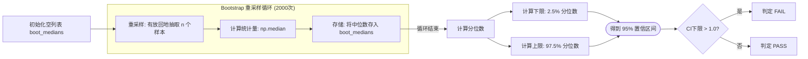

# 特殊场景处理详细说明

## 1. 小值域通过标准

### 1.1 触发条件

当golden值中存在**任意元素**小于对应dtype的Small Value Threshold时,相对误差计算不稳定,需使用小值域标准。
注意:golden标准原文描述为"当真值小于Small Value Threshold时",本实现采用保守策略,只要存在小值域元素即启用该标准。

**重要说明**: 小值域标准只针对小值域子集计算ErrorCount,不影响正常值域元素的MARE/MERE评估。
两者应并行使用,而非互斥替换。详见`should_use_small_value_standard`函数的`min_ratio`参数。

### 1.2 阈值表

| 数据类型 | Small Value Threshold | Error Threshold |
|---------|---------------------|----------------|
| FLOAT16 | 2^-11 | 2^-16 |
| BFLOAT16 | 2^-8 | 2^-16 |
| FLOAT32 | 2^-14 | 2^-30 |
| HiFLOAT32 | 2^-12 | 2^-28 |
| FLOAT8 E4M3 | 2^-4 | 2^-6 |
| FLOAT8 E5M2 | 2^-3 | 2^-5 |

### 1.3 判定方法

**ErrorCount计算：**
```python
ErrorCount = sum(|golden| < threshold and |actual - golden| > error)
```

**通过标准：**
```python
ErrorCount_npu / max(ErrorCount_third_party, 1) <= 2
```

### 1.4 使用脚本

```python
from scripts.small_value_check import check_small_value_precision, should_use_small_value_standard

# 判断是否启用
if should_use_small_value_standard(npu_output, golden_output):
    # 注意: 小值域标准要求双标杆比对,必须提供三方芯片输出
    result = check_small_value_precision(npu_output, golden_output, third_party_output)
    assert result['is_pass']
```

## 2. INF/NAN通过标准

### 2.1 判定规则详细表

| Golden值 | NPU值 | 标杆值 | 判定结果 |
|---------|-------|-------|---------|
| inf/-inf/nan | 与Golden一致 | - | **通过** |
| inf/-inf/nan | 与Golden不一致且与标杆不一致 | 与Golden一致 | **不通过**（标杆正确但NPU错误） |
| inf/-inf/nan | 与Golden不一致且与标杆不一致 | 与Golden不一致 | **需异常排查** |
| 其他值 | - | - | 按正常标准 |

### 2.2 环境变量影响

**Ascend910A及之前：**
- inf不参与精度比较,仅检查nan一致性

**Ascend910B及之后：**
- is_before_910a=True（INF_NAN_MODE_ENABLE=0）：inf不参与比较
- is_before_910a=False（INF_NAN_MODE_ENABLE=1）：要求inf输出一致

### 2.3 使用脚本

```python
from scripts.inf_nan_check import check_inf_nan_consistency

# Ascend910A及之前芯片,或910B+且INF_NAN_MODE_ENABLE=0
result = check_inf_nan_consistency(npu_output, golden_output, is_before_910a=True)
assert result['is_pass']

# Ascend910B+且INF_NAN_MODE_ENABLE=1
result = check_inf_nan_consistency(npu_output, golden_output, benchmark_output, is_before_910a=False)
assert result['is_pass']
```

## 3. 精度复检机制

### 3.1 触发条件

当算子单个用例执行不满足通过标准时，启动复检流程。

### 3.2 复检流程

1. **采样：** 更换随机种子，执行N次（推荐1000次）
2. **计算中位数：** 计算误差比值的中位数
3. **Bootstrap：** 计算95%置信区间
4. **判定：** CI_Lower > 1.0 则不通过

### 3.3 小样本熔断

**规则：** 若N < 200，直接判定不通过

**原因：** Bootstrap方法在小样本下不可靠

### 3.4 使用脚本

```python
from scripts.confidence_interval import analyze_recheck_ratios

# 收集N次运行数据,计算每次的Ratio = npu_error / benchmark_error
ratios = []
for i in range(1000):
    npu_error = calculate_error(run_npu(seed=i), golden)
    benchmark_error = calculate_error(run_benchmark(seed=i), golden)
    ratio = npu_error / max(benchmark_error, 1e-10)
    ratios.append(ratio)

# 分析复检结果
result = analyze_recheck_ratios(np.array(ratios))
assert result['recheck_pass']
```

## 4. Bootstrap流程图



## 5. 各特殊场景对比

| 特殊场景 | 触发条件 | 判定方法 | 使用脚本 |
|---------|---------|---------|---------|
| 小值域 | golden < threshold | ErrorCount ratio ≤ 2 | small_value_check.py |
| INF/NAN | 输出含inf/nan | 值一致性判定 | inf_nan_check.py |
| 复检 | 单用例不通过 | Bootstrap置信区间 | confidence_interval.py |