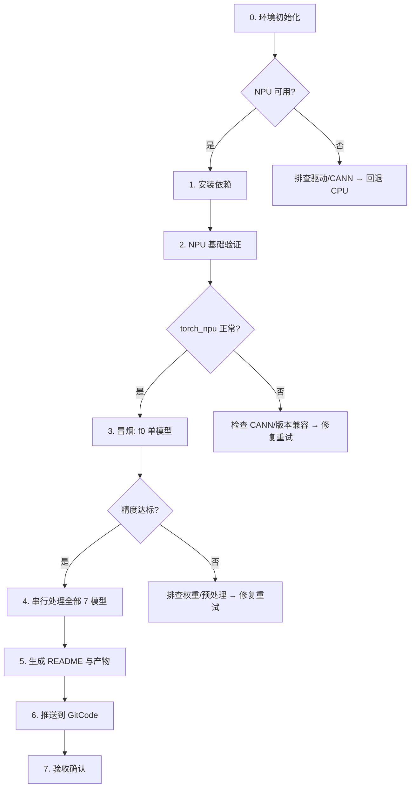

# dm_nfnet 昇腾 NPU 部署与精度验证 Skill

本 Skill 提供 7 个 dm_nfnet（Normalization-Free Net）图像分类模型在华为昇腾 NPU 上的完整部署、推理验证和 CPU/NPU 精度对比的标准化可复现流程。

## 流程概览



整体路径：环境检查 → NPU 验证 → 冒烟测试 → 批量执行 → 产物生成 → 发布 → 验收。每步有输入/输出和判定标准。

## 支持的模型列表

| # | 模型名称 | 分辨率 | 参数量 | CPU 耗时(s) | NPU 耗时(s) | 加速比 | Top-100 相对误差 | 余弦相似度 |
|---|---------|--------|--------|------------|------------|--------|-----------------|-----------|
| 1 | dm_nfnet_f0 | 192×192 | ~12M | 0.4365 | 0.0115 | 37.9× | 0.0728% | 0.999999 |
| 2 | dm_nfnet_f1 | 224×224 | ~34M | 1.1068 | 0.0212 | 52.1× | 0.0752% | 0.999999 |
| 3 | dm_nfnet_f2 | 256×256 | ~69M | 1.8065 | 0.0305 | 59.3× | 0.1163% | 0.999999 |
| 4 | dm_nfnet_f3 | 320×320 | ~116M | 3.5349 | 0.0415 | 85.1× | 0.0795% | 0.999999 |
| 5 | dm_nfnet_f4 | 384×384 | ~204M | 6.0531 | 0.0477 | 126.8× | 0.1042% | 0.999999 |
| 6 | dm_nfnet_f5 | 416×416 | ~338M | 8.4629 | 0.0561 | 151.0× | 0.1477% | 0.999998 |
| 7 | dm_nfnet_f6 | 448×448 | ~504M | 11.4712 | 0.0667 | 171.9× | 0.1100% | 0.999999 |

模型按参数量从小到大排列。推荐以 f0 作为冒烟测试入口（~12M 参数，< 0.5s CPU），通过后再覆盖 f5/f6。

## 前置条件

| 项目 | 要求 |
|------|------|
| 硬件 | Ascend910 系列（至少 1 卡），推荐 Ascend910B |
| OS | openEuler 22.03+ / Ubuntu 20.04+ / KylinOS V10 |
| CANN | >= 8.0.RC1 |
| Python | 3.9 – 3.13 |
| PyTorch | >= 2.0 |
| 网络 | 首次运行需联网从 ModelScope 下载模型权重 |
| 磁盘 | 至少 20GB 可用空间（缓存 7 个模型权重约 7GB） |

## 完整工作流程

按以下步骤顺序执行，每步需确认通过后方可进入下一步。单模型完整流程约 3-5 分钟（含下载），7 模型批量约 30-60 分钟。

| 阶段 | 步骤 | 输入 | 执行动作 | 输出 | 验证命令 | 通过标准 |
|------|------|------|---------|------|---------|---------|
| 环境准备 | 0. 环境初始化 | Ascend 节点 + CANN | source set_env.sh, npu-smi info | 环境就绪确认 | `npu-smi info` | NPU 芯片 >= 1, Health OK |
| 环境准备 | 1. 安装依赖 | Python 3.9+ 环境 | pip install torch/torch_npu/timm | 依赖安装完成 | `python3 -c "import torch_npu; import timm"` | 版本匹配、导入无报错 |
| 环境准备 | 2. NPU 基础验证 | 依赖已安装 | torch_npu 基本运算验证 | NPU 推理功能确认 | `torch.npu.is_available()` | 返回 True, 设备 tensor 可用 |
| 冒烟验证 | 3. 冒烟测试 | f0 模型 | infer + compare 脚本 | CPU/NPU 推理成功 | `python3 scripts/compare_cpu_npu.py` | 余弦相似度 > 0.999, Top-1 一致 |
| 批量执行 | 4. 串行处理 7 模型 | 冒烟通过 | run_all_models.sh | results.json + README | `python3 -c "验证全部结果"` | 全部 Top-100 误差 < 1% |
| 收尾发布 | 5. 生成产物 | 结果文件 | 自动生成 README/脚本 | 完整产物目录 | 检查产物完整性 | 每个模型有完整产物 |
| 收尾发布 | 6. 推送到 GitCode | 访问令牌 | curl 创建/推送仓库 | 模型仓库推送成功 | `git push --dry-run` | 仓库创建成功、推送无 401 |
| 收尾发布 | 7. 验收确认 | 全部产物 | 逐项检查清单 | 部署成功确认 | 清单逐项核对 | 全部 8 项检查通过 |

## 步骤 0：环境初始化（预计 1 分钟）

**输入**：已安装 CANN 的 Ascend 节点
**输出**：环境就绪确认或缺失项清单

**执行步骤**：

1. 加载 CANN 环境变量：`source /usr/local/Ascend/ascend-toolkit/set_env.sh`。
2. 检查 NPU 可用性：`npu-smi info`，确认芯片 >= 1 且 Health 为 OK。
3. 选择空闲 NPU 设备：`export ASCEND_RT_VISIBLE_DEVICES=0`。
4. 配置 PyPI 镜像（网络受限环境）：`export PIP_INDEX_URL=https://mirrors.aliyun.com/pypi/simple/`。
5. 判定：NPU 芯片 OK → 继续；否则进入「NPU 不可用」异常处理。

```bash
# 加载 CANN 环境
source /usr/local/Ascend/ascend-toolkit/set_env.sh

# 检查 NPU 可用性
npu-smi info
```

预期输出示例：
```
+-------------------------------------------------------------------------------------------+
| npu-smi 24.1.rc1                Version: 24.1.rc1                                         |
| NPU   Name                Health          Power(W)    Temp(C)           Hugepages-Usage    |
| Chip  Device              Bus-Id          AICore(%)   Memory-Usage(MB)  Memory-Util(%)     |
| 0     910B2C              OK              82.3        41                 0    / 0           |
| 0     0                   0000:01:00.0    0           18537/65536        24%               |
+-------------------------------------------------------------------------------------------+
```

```bash
# 选择空闲 NPU
export ASCEND_RT_VISIBLE_DEVICES=0

# 配置 PyPI 镜像（网络受限环境推荐）
export PIP_INDEX_URL=https://mirrors.aliyun.com/pypi/simple/
```

**判定**：NPU 芯片 >= 1 且健康状态 OK → 继续；否则进入「NPU 不可用」异常处理。

## 1. 安装依赖（预计 2 分钟）

**输入**：Python 3.9+ 环境
**输出**：完整依赖安装确认

**执行步骤**：

1. 安装核心依赖：`pip install torch torch_npu timm safetensors Pillow modelscope`。
2. 验证安装：`python3 -c "import torch; import torch_npu; import timm; print(torch.__version__, torch_npu.__version__, timm.__version__)"`。
3. 确认所有包导入无报错，版本与 CANN 兼容。
4. 若 torch_npu 版本冲突，卸载后重装匹配版本。

```bash
pip install torch torch_npu timm safetensors Pillow modelscope
```

预期输出：所有包安装成功。运行验证：
```bash
python3 -c "import torch; import torch_npu; import timm; print('torch:', torch.__version__); print('torch_npu:', torch_npu.__version__); print('timm:', timm.__version__)"
```

## 2. NPU 基础验证（预计 1 分钟）

**输入**：依赖已安装
**输出**：NPU 推理功能确认

**执行步骤**：

1. 运行 NPU 基础验证脚本：`python3 -c "import torch; import torch_npu; print('NPU available:', torch.npu.is_available())"`。
2. 确认 `torch.npu.is_available()` 返回 `True`，设备数量 >= 1。
3. 执行 NPU tensor 基本运算：创建随机 tensor 并移至 NPU 设备。
4. 确认输出包含 `device='npu:0'` 且无报错。

```bash
python3 -c "
import torch
import torch_npu
print('torch:', torch.__version__)
print('NPU available:', torch.npu.is_available())
print('NPU count:', torch.npu.device_count())
a = torch.randn(3, 4).npu()
print(a + a)
"
```

**通过标准**：输出包含 `device='npu:0'` 的 Tensor 且无报错。`npu.is_available()` 返回 `True`。

## 3. 冒烟测试 — f0 单模型验证（预计 5 分钟）

**输入**：dm_nfnet_f0 模型名和测试图片
**输出**：单模型 CPU/NPU 推理成功、精度达标

先跑最小模型 f0 验证全链路，避免批量跑完后才发现环境问题。

**执行步骤**：

1. 下载模型权重：`python3 -c "from modelscope.hub.snapshot_download import snapshot_download; snapshot_download('timm/dm_nfnet_f0.dm_in1k')"`。
2. CPU 推理验证：`python3 scripts/infer_nfnet.py --model dm_nfnet_f0.dm_in1k --image test.jpg --device cpu`。
3. NPU 推理验证：`python3 scripts/infer_nfnet.py --model dm_nfnet_f0.dm_in1k --image test.jpg --device npu`。
4. CPU/NPU 精度对比：`python3 scripts/compare_cpu_npu.py --model dm_nfnet_f0.dm_in1k --image test.jpg`。
5. 判定：余弦相似度 > 0.999 且 Top-1 一致 → 继续；否则进入精度异常处理。

```bash
# 下载权重
python3 -c "
from modelscope.hub.snapshot_download import snapshot_download
path = snapshot_download('timm/dm_nfnet_f0.dm_in1k')
print(f'Downloaded to: {path}')
"

# CPU 推理
python3 scripts/infer_nfnet.py --model dm_nfnet_f0.dm_in1k --image test.jpg --device cpu

# NPU 推理
python3 scripts/infer_nfnet.py --model dm_nfnet_f0.dm_in1k --image test.jpg --device npu

# 精度对比
python3 scripts/compare_cpu_npu.py --model dm_nfnet_f0.dm_in1k --image test.jpg
```

预期输出（CPU/NPU 对比）：
```json
{"model": "dm_nfnet_f0.dm_in1k", "top1_match": true, "top5_overlap": 5, "cosine_similarity": 0.999999, "top100_error": "0.0728%", "status": "pass"}
```

**判定**：余弦相似度 > 0.999 且 Top-1 分类一致 → 继续；否则进入「精度不达标」异常处理。

## 4. 串行处理全部 7 模型（预计 30-60 分钟）

**输入**：步骤 3 冒烟通过
**输出**：每个模型目录下的 `results.json`、`README.md` 和脚本

**执行步骤**：

1. 确认环境：磁盘 >= 20GB、网络可用、NPU 空闲、预估 30-60 分钟。
2. 执行批量脚本：`bash examples/run_all_models.sh`。
3. 监控中间输出，确认每个模型显示 PASS（余弦相似度 > 0.999、Top-1 一致）。
4. 模型之间自动调用 `torch.npu.empty_cache()` 释放显存，避免累积。

```bash
bash examples/run_all_models.sh
```

模型串行执行：f0 → f1 → f2 → ... → f6，每完成一个调用 `torch.npu.empty_cache()` 释放显存。运行期间不要同时在同一个 NPU 上执行其他任务。

中间输出示例：
```
[1/7] dm_nfnet_f0 ... cpu=0.4365s npu=0.0115s speedup=37.9x cos=0.999999 top1_match=OK PASS
[2/7] dm_nfnet_f1 ... cpu=1.1068s npu=0.0212s speedup=52.1x cos=0.999999 top1_match=OK PASS
...
```

## 5. 生成 README 与产物（自动执行）

**输入**：步骤 4 的结果文件
**输出**：每个模型目录下的完整产物

**执行步骤**：

1. 自动为每个模型生成 `models/<name>/results.json`：包含推理延迟、精度指标。
2. 自动生成 `README.md`：含真实测试数据的中文文档。
3. 复制标准推理脚本：`inference.py`（NPU 推理）和 `compare_cpu_npu.py`（精度对比）。
4. 确认每个模型目录产物完整后再进入下一步。

| 产物 | 说明 |
|------|------|
| `models/<name>/results.json` | 详细推理数据和精度指标 |
| `models/<name>/README.md` | 含真实测试数据的中文文档 |
| `models/<name>/inference.py` | NPU 推理脚本 |
| `models/<name>/compare_cpu_npu.py` | CPU/NPU 精度对比脚本 |
| `models/<name>/screenshot.png` | 终端运行截图 |

## 6. 推送到 GitCode 模型仓库

**输入**：GitCode 访问令牌
**输出**：7 个模型仓库推送成功

**执行步骤**：

1. 设置 GitCode 访问令牌：`export ATOMGIT_USER_TOKEN=<your_token>`。
2. 对每个模型创建 GitCode 仓库：curl POST 创建模型仓库（命名规则：`{model_name}-npu`）。
3. 推送模型目录到对应仓库。
4. 确认推送成功：接口返回 201/200，无 401/403 错误。

```bash
export ATOMGIT_USER_TOKEN=<your_token>

curl -X POST "https://api.gitcode.com/api/v5/user/repos" \
  --header "private-token: ${ATOMGIT_USER_TOKEN}" \
  --header "Content-Type: application/json" \
  --data '{
    "name": "dm_nfnet_f0.dm_in1k-npu",
    "path": "dm_nfnet_f0.dm_in1k-npu",
    "private": false,
    "repository_type": "model"
  }'
```

仓库命名规则：`{model_name}-npu`（如 `dm_nfnet_f0.dm_in1k-npu`）。

## 7. 验收确认

**输入**：全部 7 模型运行产物
**输出**：部署成功确认

**执行步骤**：

1. 确认 NPU 设备正常：`npu-smi info` 显示设备 Health OK。
2. 确认所有模型推理成功：CPU 和 NPU 推理命令均无报错。
3. 确认精度达标：所有模型 Top-100 平均相对误差 < 1%，Top-1 分类一致。
4. 确认产物完整：每个模型目录包含 README、脚本和结果文件。
5. 确认 GitCode 推送成功：仓库页面可访问或 API 返回成功。

检查清单：

- [ ] `npu-smi info` 显示设备正常
- [ ] `import torch_npu` 无报错
- [ ] 所有模型在 CPU 上成功运行推理
- [ ] 所有模型在 NPU 上成功运行推理
- [ ] 所有模型的 Top-100 平均相对误差 < 1%
- [ ] 所有模型的 Top-1 分类结果一致
- [ ] 每个模型目录都生成了完整 README 和脚本
- [ ] 每个模型都推送到了 GitCode 模型仓库

## 快速开始

## 单模型处理

```bash
# CPU 推理
python3 scripts/infer_nfnet.py --model dm_nfnet_f0.dm_in1k --image test.jpg --device cpu

# NPU 推理
python3 scripts/infer_nfnet.py --model dm_nfnet_f0.dm_in1k --image test.jpg --device npu

# CPU/NPU 精度对比
python3 scripts/compare_cpu_npu.py --model dm_nfnet_f0.dm_in1k --image test.jpg
```

## 批量处理全部 7 模型

```bash
bash examples/run_all_models.sh
```

## 按规格分组运行

```bash
# 小模型快速验证（f0-f2，预计 10 分钟）
for m in dm_nfnet_f0.dm_in1k dm_nfnet_f1.dm_in1k dm_nfnet_f2.dm_in1k; do
    python3 scripts/compare_cpu_npu.py --model "$m" --image test.jpg
done

# 大模型（f5-f6，显存需求最大，预计 15 分钟）
for m in dm_nfnet_f5.dm_in1k dm_nfnet_f6.dm_in1k; do
    python3 scripts/compare_cpu_npu.py --model "$m" --image test.jpg
done
```

## 执行检查点与用户确认

以下节点在执行不可逆操作前会暂停并要求用户确认：

| 检查点 | 时机 | 确认内容 | 超时处理 |
|--------|------|---------|---------|
| CK-01 | 批量运行 `run_all_models.sh` 前 | 确认磁盘 >= 20GB、网络可用、NPU 空闲、预估 30-60 分钟 | 30s 无输入视为取消 |
| CK-02 | 首次下载模型权重前 | 确认 `~/.cache/modelscope/` 分区空间 > 7GB | 提示后继续 |
| CK-03 | 推送到 GitCode 前 | 确认 `ATOMGIT_USER_TOKEN` 已设置、全部 7 模型精度达标 | 必须显式确认 y/n |
| CK-04 | 冒烟测试前（首次运行） | 确认环境初始化通过、NPU 芯片状态 OK | 失败则阻断后续步骤 |
| CK-05 | 切换 Python 虚拟环境时 | 确认已激活正确的 venv/conda、依赖版本匹配 | 警示但不阻断 |

## 异常处理与回滚策略

## 运行时异常

| 异常场景 | 表现 | 根因排查 | 处理方式 |
|----------|------|---------|---------|
| NPU 不可用 | `npu-smi info` 无输出或 permission denied | `lsmod \| grep davinci`；`dmesg \| grep -i npu` | `sudo npu-smi`；仍失败则回退 CPU：`--device cpu` |
| CANN 未加载 | `No module named 'torch_npu'` | CANN 环境变量未设置 | `source /usr/local/Ascend/ascend-toolkit/set_env.sh` 后重试 |
| torch_npu 版本不兼容 | `import torch_npu` 报 `undefined symbol` | CANN 与 torch_npu 版本不匹配 | `pip list \| grep torch_npu` 确认版本；卸载重装匹配版本 |
| 模型权重未下载 | `FileNotFoundError: model.safetensors` | 权重文件缺失 | `python3 -c "from modelscope.hub.snapshot_download import snapshot_download; snapshot_download('timm/<model_name>')"` |
| 下载中断 | 下载中途网络断开 | 缓存目录残留不完整文件 | `find ~/.cache/modelscope/ -name "*.part" -delete`；重试下载 |
| 单模型 OOM | `torch.cuda.OutOfMemoryError` 或 `DRV_ERROR_MEMORY_ALLOCATION` | f5/f6 模型较大（~338M/~504M），显存不足 | 确保每个模型后调用 `torch.npu.empty_cache()`；单独跑大模型；仍不行则 CPU 降级 |
| 多卡意外并行 | 多个终端同时运行批量脚本 | `npu-smi info` 查看 Memory-Usage 异常飙升 | 立即 kill 多余进程 |
| 精度不达标 | Top-100 相对误差 > 1% 或 Top-1 不匹配 | 权重 checksum 不一致；预处理 pipeline 差异；注意整体 max_rel_diff 可能被近零 logit 值放大 | 检查 `model.safetensors` 完整性；对比 CPU 端参考输出；用 `--debug` 标志输出中间值 |
| ImageNet 标签差异 | CPU/NPU Top-1 不同但 logits 高度一致 | timm 不同版本 ImageNet 标签映射差异 | 以 logits 余弦相似度为准（> 0.999 视为通过），而非仅依赖 Top-1 匹配 |
| 冷启动慢 | 首个模型首次推理耗时异常高 | NPU 算子 JIT 首次编译开销 | 以第二个模型起耗时为准；或将 f0 作为 warm-up 不计入统计 |
| GitCode 推送失败 | 401/403 或 connection refused | token 过期或权限不足 | `echo $ATOMGIT_USER_TOKEN` 确认 token 已设置；检查仓库是否已存在；API rate limit |

## 回滚与降级

```bash
# 回退到纯 CPU 推理
python3 scripts/infer_nfnet.py --model dm_nfnet_f0.dm_in1k --image test.jpg --device cpu

# 清理特定模型缓存（节省空间）
rm -rf ~/.cache/modelscope/hub/timm/dm_nfnet_f0.dm_in1k/

# 完全重置
rm -rf ~/.cache/modelscope/hub/timm/dm_nfnet*
rm -rf models/dm_nfnet_*/
git checkout -- .

# 单模型显存强制释放
python3 -c "import torch; import gc; gc.collect(); torch.npu.empty_cache()"
```

## 模型说明

## 支持的模型名称

`--model` 参数支持的 7 个模型：

```
dm_nfnet_f0.dm_in1k
dm_nfnet_f1.dm_in1k
dm_nfnet_f2.dm_in1k
dm_nfnet_f3.dm_in1k
dm_nfnet_f4.dm_in1k
dm_nfnet_f5.dm_in1k
dm_nfnet_f6.dm_in1k
```

## 输出格式

```python
output = model(input_tensor)  # 返回 logits
probs = torch.nn.functional.softmax(output[0], dim=0)  # 转为概率
```

- 输入：RGB 图像，分辨率因模型而异（192×192 ~ 448×448）
- 输出：1000 类 ImageNet 概率分布

## 精度指标说明

| 指标 | 说明 | 通过标准 |
|------|------|---------|
| Cosine Similarity | 输出 logits 的余弦相似度 | > 0.999 |
| Top-100 平均相对误差 | Top-100 logits 的平均相对误差百分比 | **< 1%** |
| Top-1 匹配 | CPU 与 NPU 的 Top-1 分类结果是否一致 | 必须一致 |
| Top-5 重叠数 | CPU 与 NPU 的 Top-5 分类重叠数 | 5/5 |

**核心标准：NPU 与 CPU 推理结果的 Top-100 平均相对误差 < 1%，Top-1 分类一致。**

实测结果：所有 7 个模型均通过精度验证，Top-100 平均相对误差 < 0.15%，余弦相似度 > 0.999998。

## 资源与评测产物

## 脚本资源

| 路径 | 说明 | 用途 |
|------|------|------|
| `scripts/infer_nfnet.py` | 主推理脚本 | 支持 `--device cpu/npu` 切换 |
| `scripts/compare_cpu_npu.py` | 精度对比脚本 | 生成 `results.json` |
| `examples/run_single_model.sh` | 单模型一键运行 | 快速验证 |
| `examples/run_all_models.sh` | 7 模型批量串行 | 完整基准测试 |

## 参考文档

| 路径 | 说明 |
|------|------|
| `references/test_results.md` | 全模型实测结果汇总 |
| `references/benchmark_results.json` | 结构化基准测试结果 |

## 评测产物

| 路径 | 说明 |
|------|------|
| `test-prompts.json` | 4 个冒烟测试用例，覆盖单模型、批量、OOM 排查、下载中断场景 |
| `references/test_results.md` | 每次运行后更追加的精度对比汇总 |

## Skill 输入参数

| 参数 | 类型 | 必填 | 说明 |
|------|------|------|------|
| model | string | 否 | 要处理的模型名称（默认全部 7 个） |
| image | string | 是 | 测试图像路径 |
| device | string | 否 | 推理设备（cpu/npu，默认 npu） |
| weights | string | 否 | 权重文件路径（默认自动检测） |
| push_to_gitcode | bool | 否 | 是否推送到 GitCode |
| gitcode_token | string | 否 | GitCode 访问令牌（默认使用 ATOMGIT_USER_TOKEN） |

## 资源释放

每个模型测试完成后主动释放资源，避免显存累积：

```python
import gc
gc.collect()
torch.npu.empty_cache()
```

串行执行多个模型时，确保在下一个模型开始前调用上述清理代码。
